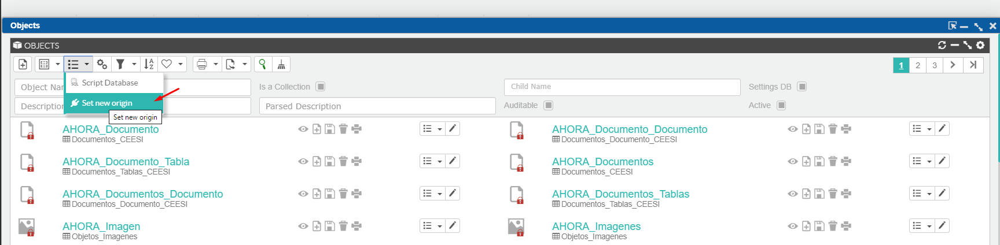
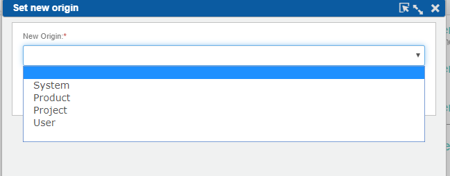

# Desarrollando: script para cambiar el OriginId de todas nuestras modificaciones

## Ámbito

Entorno de desarrollo de un proyecto/solución/producto.

## Situación

Hemos realizado cambios en nuestro desarrollo sin haber marcado el origen de las modificaciones.

!!! note "Nota"
    Para cambiar nuestro origen, iremos a la colección de objetos, donde tenemos un proceso desde el cual podemos cambiar el origen. Esta configuración implica que todos los registros serán marcados con el nuevo origen (sistema, producto, proyecto o usuario).





Esta situación implica que, cuando queramos scriptar nuestros cambios, vamos a tener un problema para localizarlos y guardarlos.

La solución pasa por localizar y actualizar los registros que tienen un `OriginId` distinto al deseado.

Para ello ejecutaremos el script adjunto, que nos devuelve los updates para dejar los registros correctamente.

El código está preparado para pasar de origen "Project" (id 2) a origen "Product" (1), pero puede alterarse asignando distintos orígenes a las siguientes variables:

```sql
set @OldOriginId=2
set @NewOriginId=1
```

Tras ello ya podremos ejecutar el `zscript`, que nos generará los ficheros SQL de cambios de nuestra aplicación/producto.

Ejemplo:

```
zscript 1, 'C:\Codigo GIT\Flexygo\flexygo\BBDD\FLEXIGOBD\FLEXIGOBD\scripts\staticdata '
```

## Archivo adjunto

Descarga [CambiarOriginId.sql](./readme/utils/CambiarOriginId.sql).

## Véase también

* [Cómo funciona el OriginId en 4 pasos](OriginIdExplained.md)
* [Estoy actualizando versión, obtengo error de conflicto Foreign Key](ForeignKeyConflict.md)
