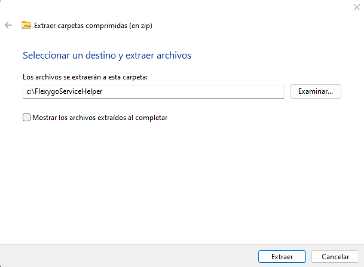
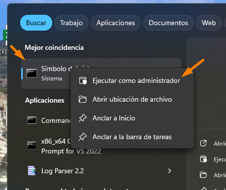

# ¿Cómo puedo eliminar el servicio de Flexygo, forzar la actualización o instalarlo sin instalar un Flexygo en esa máquina?

Descarga el zip adjunto y extráelo en una carpeta del servidor, por ejemplo `C:\FlexygoServiceHelper`.



Abre una ventana de CMD en modo administrador.



Accede a la carpeta donde has extraído el zip usando el comando:

```
cd c:\FlexygoServiceHelper
```

Para eliminarlo, ejecuta el siguiente comando:

```
EliminarServicio.bat
```

Para instalarlo, ejecuta el siguiente comando:

```
InstalarServicio.bat
```

Para actualizarlo, simplemente ejecuta ambos comandos:

```
EliminarServicio.bat
InstalarServicio.bat
```

## Archivos adjuntos

Descarga [FlexygoServiceHelper.zip](./readme/utils/FlexygoServiceHelper.zip).
