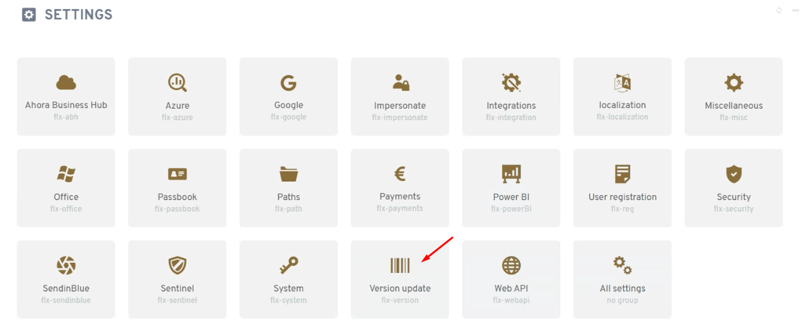
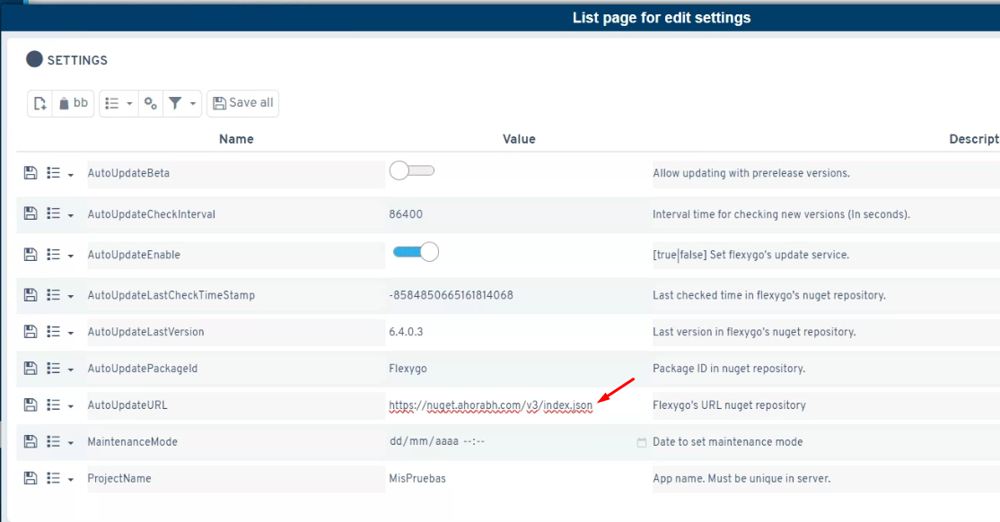
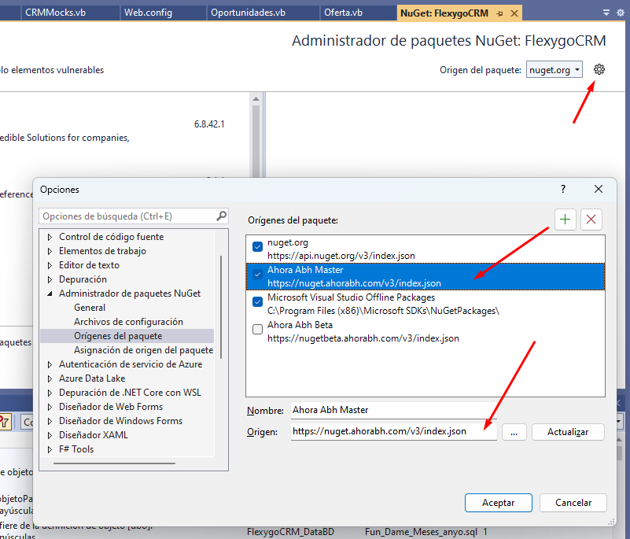

# Notice: new URLs for updating Flexygo applications and updating the Flexygo package in Developments

Due to a new deployment/migration of the Flexygo NuGet package server, we recommend the following:

## 1. Update the update setting for By Flexygo products

In the `AutoUpdateURL` setting you'll need to specify the new address `https://nuget.ahorabh.com/v3/index.json` for those applications that still have the `nuget.flexygo.com/nuget` address.

!!! warning "Important"
    It's very important that the new URL is written correctly, with no extra spaces or characters; otherwise it will fail when trying to connect and retrieve the versions.

## 2. Update in Visual Studio

If you're developing Flexygo applications/products through Visual Studio, when updating the Flexygo NuGet version you'll also need to change the **package source**, specifying the URL `https://nuget.ahorabh.com/v3/index.json`:

