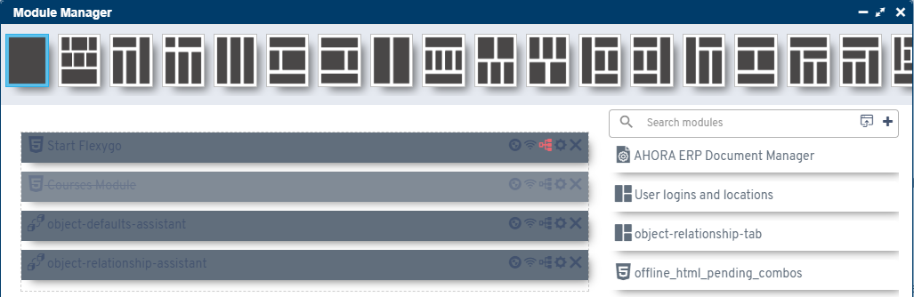

# Versión 6.0

## Novedades principales

* Migración tecnológica de librerías de .NET Framework a .NET Standard
* Valores por defecto disponibles en procesos de carga
* Traducción de mensajes de carga en procesos
* Auditoría de errores configurable en objetos y procesos
* Nuevo parámetro para establecer proceso al hacer login con Azure
* Estilo renovado en gestión de módulos para mostrar módulos inactivos

* Test de compilación para procesos C# embebidos
* Compatibilidad con NuGet V3

## Correcciones implementadas

* Resolución de dependencias en control "monaco"
* Mejoras en informes HTML con canvas
* Interpretación de caracteres especiales en chatter
* Procesos de inserción stored con tablas adicionales
* Controles dbcombo y multicombo en formularios
* Dependencias de filtros
* Servidores vinculados
* Reordenamiento de componente flx-list
* Timeline al redimensionar
* Botones maximizar/cerrar en ventanas slide
* Eliminación de registros en chatter con respuestas
* Selección de registros con procesos de bolsa
* Gestión documental y eventos
* Informes DevExpress
* Nodos autogenerados

## Funcionalidades obsoletas

Los procesos C# embebidos migrarán de compilación en .NET Framework a compilación en .NET Standard.
