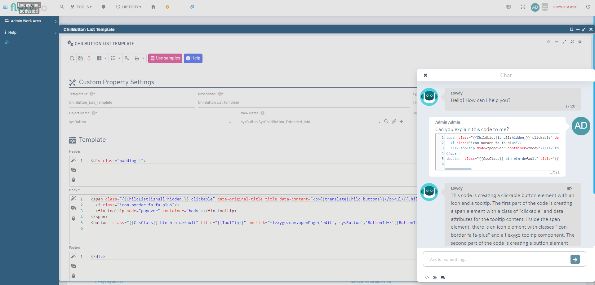
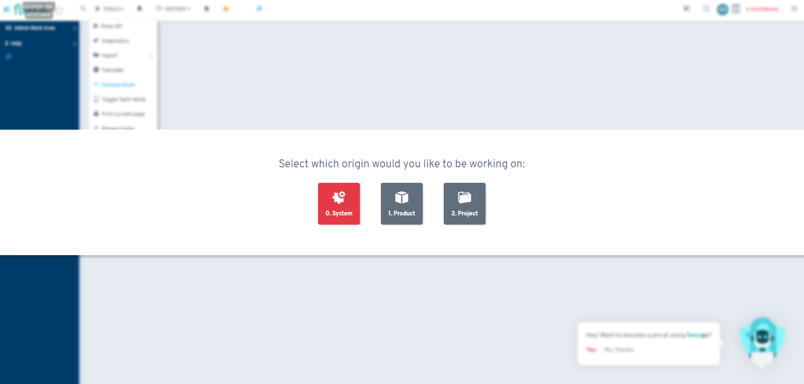

# Versión 6.1

## Novedades

* Capacidad de ejecutar un proceso directamente desde el listado de procesos
* Integración con **OpenAI** para usar **ChatGPT** en controles de código

* Traducción de títulos de menús en aplicaciones offline
* Opción para configurar **URLs** amigables en objetos
* Parámetro para seleccionar día de inicio en módulos de calendario mensual
* Nueva pantalla para seleccionar origin id al entrar en modo desarrollo desde Visual Studio

* Mantenimiento del modo desarrollo al clonar pestañas del navegador
* Exportación de base de datos en formato JSON multilínea para mejorar legibilidad
* Opción de hacer copia de seguridad en aplicaciones con modelo de datos
* Cambios en exportación estándar a Excel para comportarse como informes tipo Excel
* Selección de columnas a exportar a Excel desde listados

## Correcciones

* Módulos SQL list con templates y agrupaciones
* Cronjobs con parámetros
* Módulo chatter en dispositivos móviles
* Propiedades radio en dispositivos móviles
* Botoneras con clases txt
* Integraciones con Google y Office
* Aplicaciones offline con vistas de clave múltiple
* Dependencias en controles flx-image
* Minimización de modales
* Dependencias en controles flx-radio
* Visualización de esquema de base de datos en apartado offline
