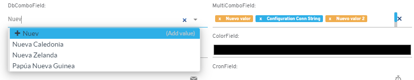
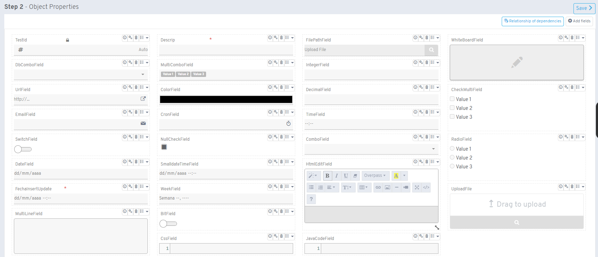

# Versión 6.2

## Novedades

* Los componentes flx-dbcombos y flx-multicombos ahora permiten agregar nuevos valores que se guardan en el objeto asociado

* El property manager ha sido rediseñado para mostrar todas las propiedades de manera uniforme con la vista de edición

* Posibilidad de asignar un esquema predeterminado al crear objetos mediante el asistente
* Los procesos de inserción, actualización y borrado aceptan tipo C# Embedded
* Soporte para envío de parámetros JSON a procesos (convertidos a string)
* Las imágenes flx-img permiten configurar color de texto y fondo
* Los nodos Object List ahora utilizan presets
* Los procesos JavaScript incluyen parámetro eventData con información del evento
* Nueva opción en menú de desarrollador para acceder a procesos de objeto o colección

## Correcciones

* Los controles check y switch mantienen valores al ser afectados por dependencias
* Los listados cargan correctamente filtros al recargar página
* Los callbacks de mensajes prompt se ejecutan una sola vez con Enter
* Error corregido en flx-chatter al mencionar usuarios con avatar
* flx-textareas sin opciones en módulos HTML cargan correctamente
* flx-htmledits restauran controles eliminados en versión anterior
* Correcciones en obtención de templates de correos
* JobLog muestra tiempo real de ejecución de cron
* Errores solucionados en vistas de objetos Oracle

## Funcionalidades obsoletas

* **Requisito obligatorio:** .NET Framework 4.7.2 instalado en IIS Server ([descargar](https://dotnet.microsoft.com/es-es/download/dotnet-framework/net472))

