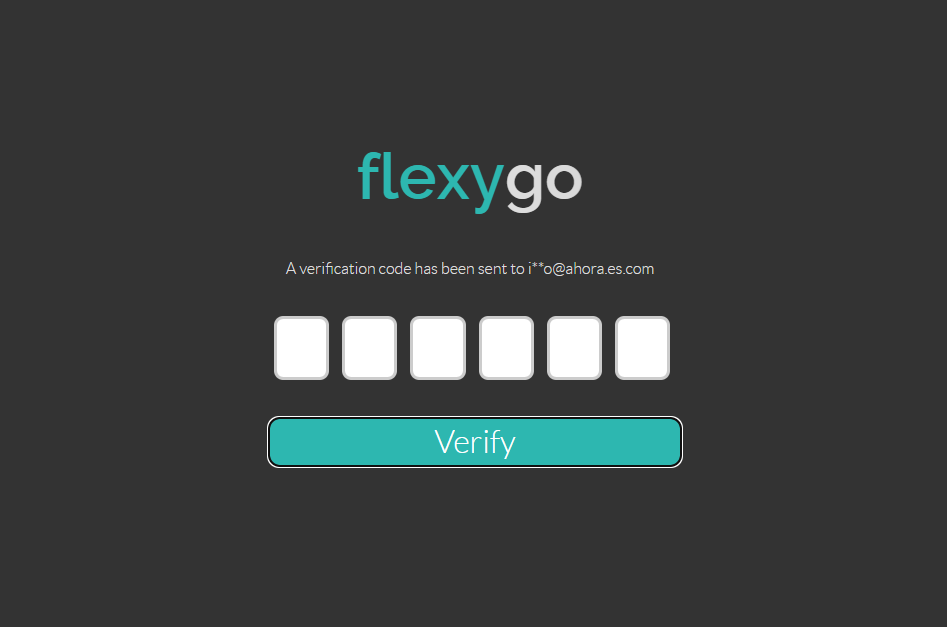
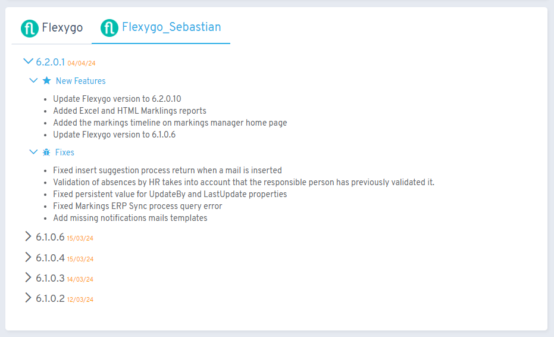
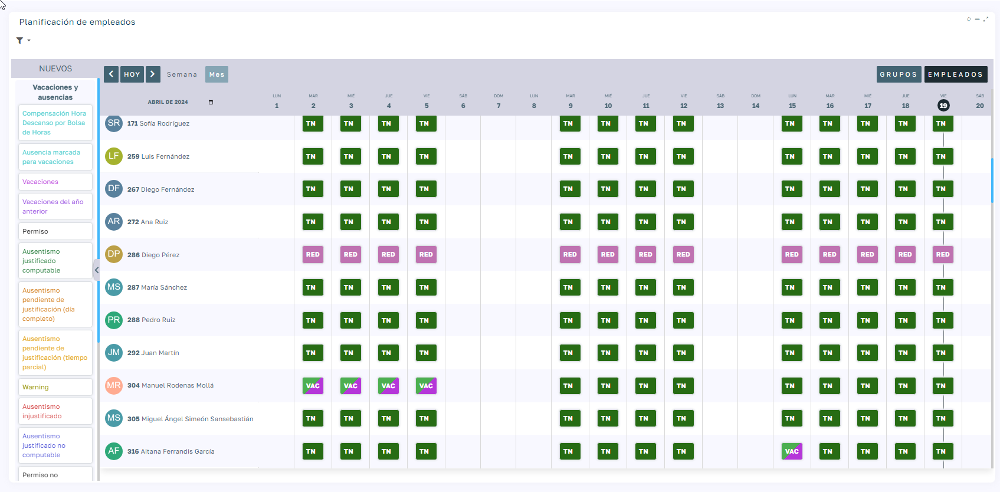
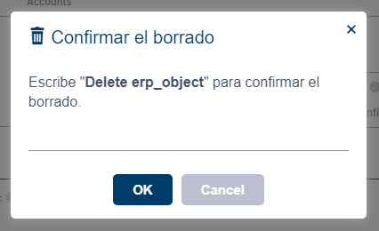

# Versión 6.3

## Novedades principales

* **Autenticación Multi-Factor (MFA)**: implementación de MFA mediante SMS o correo electrónico para reforzar la seguridad de datos

* **Nueva página de versiones**: migración a NuGet V3 con información detallada sobre Flexygo y productos asociados

* **Módulo "Planificador"**: nueva herramienta para crear y visualizar planificaciones de múltiples objetos de forma configurable

* **Borrado seguro confirmado**: opción de configurar eliminación de datos con confirmación por texto

* **Mejoras de rendimiento**:
    * Carga más rápida del administrador de módulos
    * Combos/dbcombos cargan valores únicamente al visualizar objetos
    * Asignación de descripción de página como título mediante `{{PageDescrip}}`
* **Funcionalidad ampliada**: callback en `flexygo.utils.execprocess` al cerrar ventanas de parámetros
* **Estilos mejorados**: nueva documentación de "Test Methods" en Web Api con modo oscuro

## Correcciones principales

* Creación de contactos en MailChimp desde campañas
* Objetos en Oracle con campos Identity y booleanos
* Generación de colores aleatorios mejorada
* Carga múltiple en gestión documental ERP
* Validadores de mínimo y máximo
* URLs amigables con Unique Identifier
* Funcionamiento en directorios virtuales
* Combos con valores conteniendo comillas
* Parámetros por defecto en informes
* Compatibilidad iPad con Chrome
