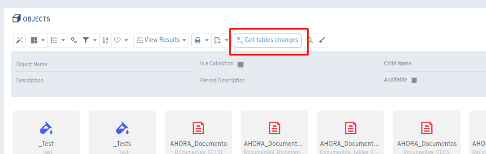
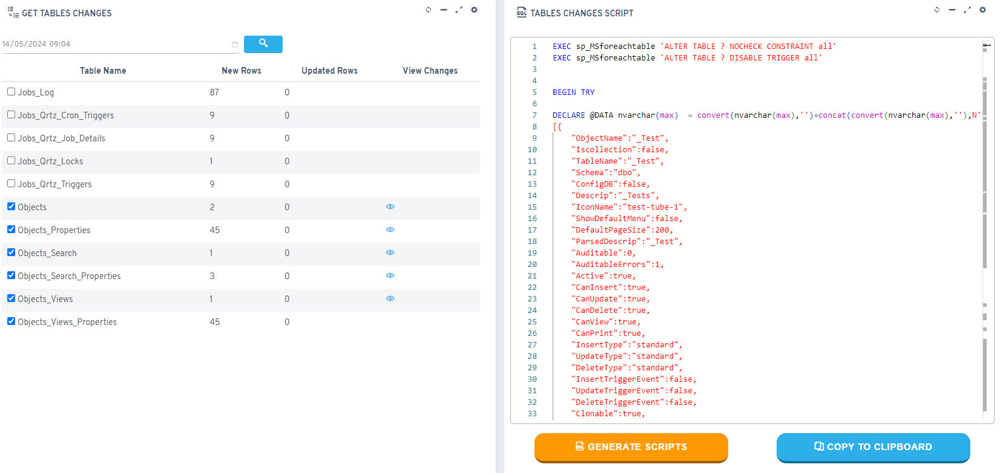
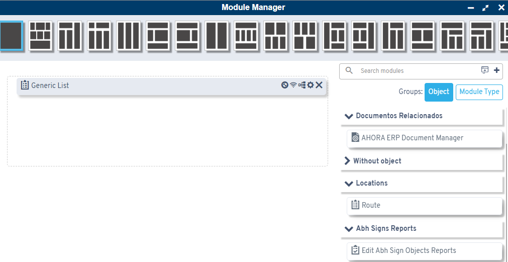
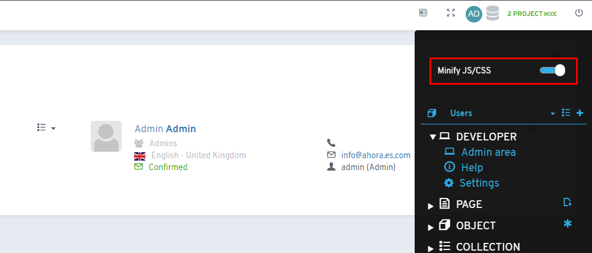
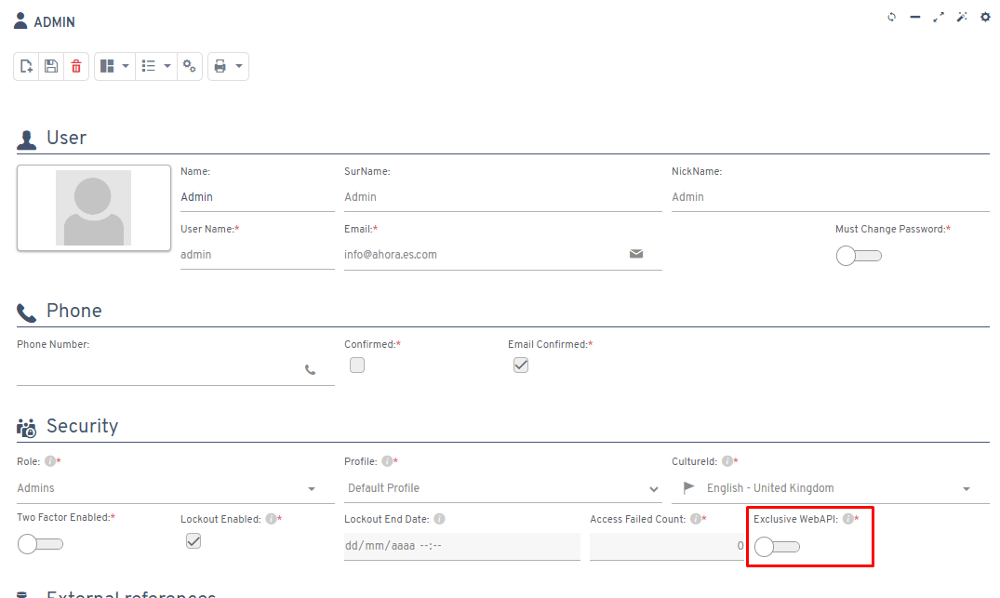

# Version 6.4

## New features

* **New audit fields**: added `flxInsertedBy`, `flxUpdatedBy`, `flxInsertedDate` and `flxUpdatedDate` to configuration tables
* **Script generation screen**: new tool to view and generate change scripts, with filtering by reference date

* **Grouping in the module manager**: option to group by module type or object to improve display and search

* **Developer menu**: added a quick option to change bundle optimization

* **Dedicated WebApi users**: new option in the user form to designate users dedicated solely to the WebApi

* **File size limit**: new field to set MB restrictions for document and image management
* **Biometric signature**: new ABH Sign type for in-person signatures (BIO)
* **Automatic node update**: changes made through wizards are now applied automatically
* **Improved SendTemplateMail**: lets you pass base64 images as parameters for compatibility with multiple mail providers
* **2FA authentication with AAD**: integrated two-factor authentication with Azure Active Directory sign-in
* **Automatic tooltip closing**: tooltips now close when scrolling
* **Component dependencies**: dependency functionality between filter properties in flx-kanban, flx-timeline and flx-planner

## Fixes

* Parsing of default values in group template headers and footers
* Improved error messages for AAD sign-in exceptions
* Security on flx-scheduler objects
* Styles in script job templates
* Loop in before/after insert JS processes
* Loading JS/CSS files in upload controls with no object (admins only)
* Value display in templates with edit SQL
* Closing the parameter wizard window
* Offline image synchronization
* Swagger definition in WebApi with empty reference URLs
* Context menu on Oracle objects
* MFA redirection on virtual directory paths
* Updated the MailChimp NuGet library
