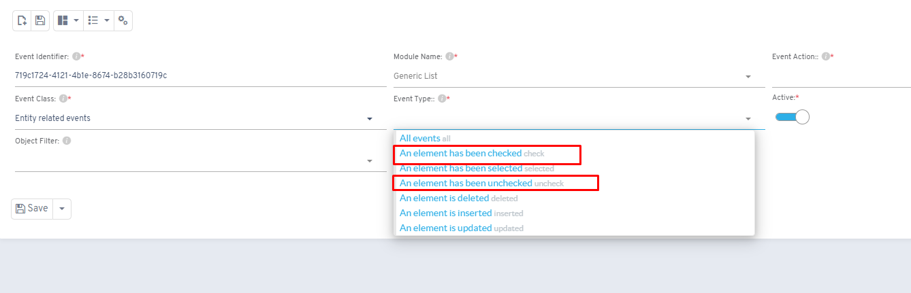
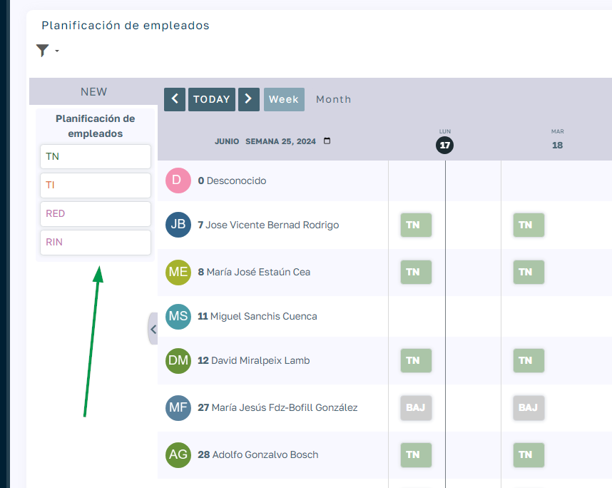
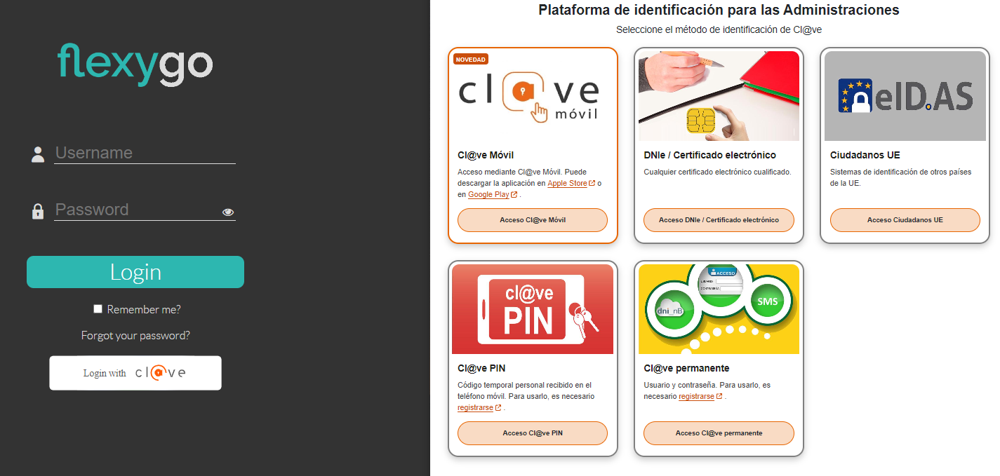
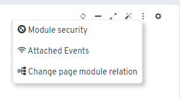
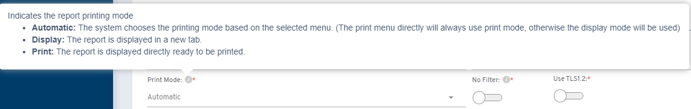

# Version 6.5

## Deprecated features

* Framework version 4.6.1 is now deprecated; you need to move to version 4.6.2

## New features

* New `show-*`, `show-only-*` and `hide-only-*` classes to control visibility based on screen size
* Module events added for checking/unchecking items

* Structure templates to create actions and vacations linked to employees through the scheduler
* Filtering of draggable objects in the scheduler

* Save edit forms with CTRL + S
* Ability to move alert, confirm and prompt windows
* "Skeleton" templates for module loading

* Integration with the Cl@ve system for authentication

* New options button in development mode

* AxSede product added to the marketplace
* Application monitoring and metrics
* Option to choose the print mode in PDF reports

## Fixes

* Value display in dbcombo/multicombo controls inside modal windows
* Scheduler functionality when inserting/updating objects
* Module and page print options
* HTML Editor on mobile devices
* Collection security with a configured order
* Filter dependencies in modules inside tabs
* WebAPI definition
* Opening/closing slide-type pages
* Value list paginator
* Modal forms on mobile devices
* Closing forms with ESC
* Script jobs with statements separated by GO
* Numeric range control in touch mode
* Opening nodes with no whitespace
* Sending documents by email without CC
* Scripts with databases of different collations
