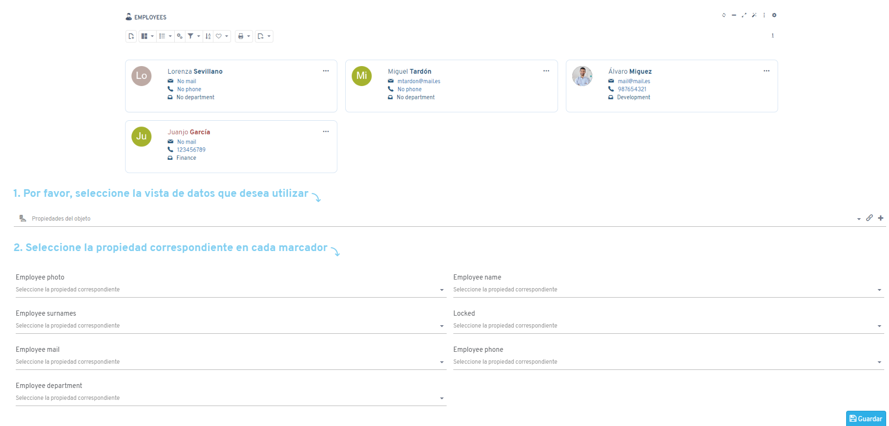
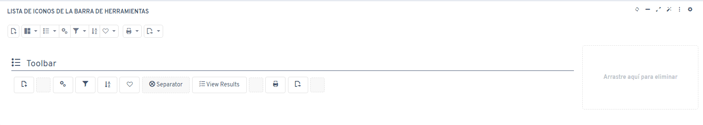
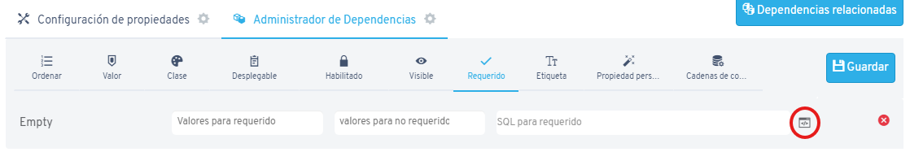
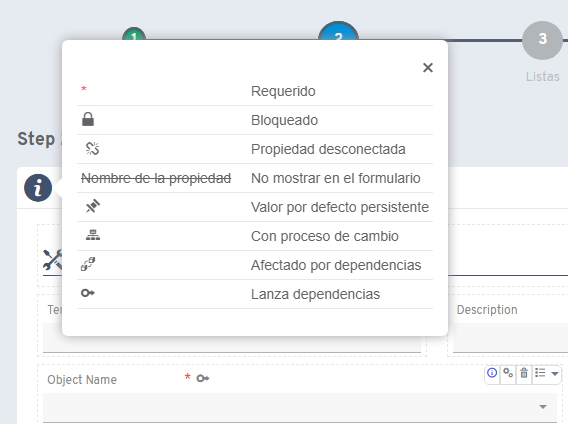

# Versión 6.6

## Novedades

* Asistente innovador para la creación de plantillas

* Atajos administrativos: F1 para ayuda y F2 para configuración
* Opción para editar plantillas en nueva ventana con auto-actualización
* Mejoras en la gestión de botones de barra de herramientas

* Editor SQL integrado para campos SQL en dependencias

* Nueva dependencia para modificar etiquetas de propiedades

* Botón informativo sobre iconos en asistente de propiedades

* Botón en notificaciones para visualizar todas las alertas
* Mención automática al autor en respuestas de chat
* Proceso mejorado para crear propiedades personalizadas desde existentes

## Correcciones

* Exportaciones Excel respetan orden y filtros
* Módulos tabuladores con inicio manual funcionan correctamente
* Plantillas "skeleton" con inicio manual optimizadas
* Errores en controles dbcombos y multicombos en listas corregidos
* Plantillas "skeleton" con gráficas y tabuladores reparadas
* Integración MailChimp funcionando correctamente
* Botones dbcombo bloqueados sin problemas
* Parseo de funciones JavaScript con parámetros mejorado
* Exportaciones Excel con módulos listas SQL ajustadas
