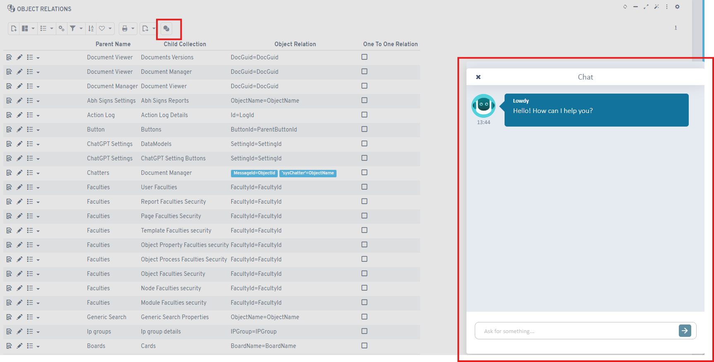
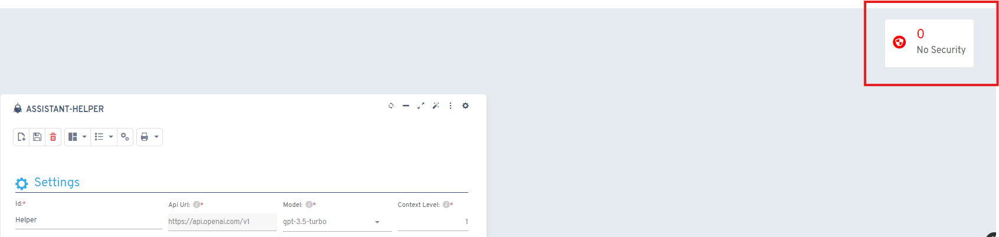
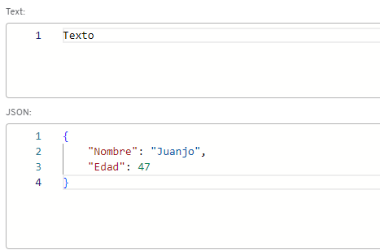
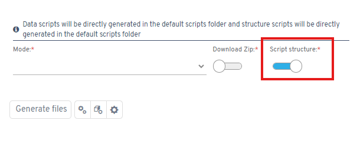

# Versión 6.7

## Novedades

* Integración de componente flx-chart preconfigurado dentro de flx-list
* Validación de campos obligatorios en inserciones vía web API
* Nuevo botón tipo "Asistente ChatGPT" para barras de herramientas

* Seguridad mejorada en configuraciones del Asistente ChatGPT

* Acceso a valores predeterminados de página desde botones de proceso
* Ocultación automática de botones principales sin secundarios activos
* Controles JSON y texto plano innovadores

* Generación de scripts de estructura de base de datos para proyectos personalizados

* Validadores SQL en controles switch
* Manejo de errores en reportes DevExpress
* Definiciones de funciones offline en intellisense Monaco

## Correcciones

* Exportación a Excel en listados editables mejorada
* Exportación de módulos tabulados a Excel solucionada
* URLs amigables corregidas
* Guardado de líneas en listados editables optimizado
* Controles Monaco estabilizados
* Compatibilidad con servidores vinculadores de caracteres especiales
* dbcombo sin permisos de inserción funcionando correctamente
* Módulos tabulados con presets y eliminación en búsqueda inicial reparados
