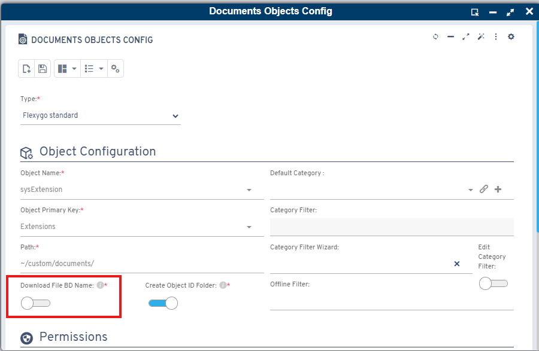
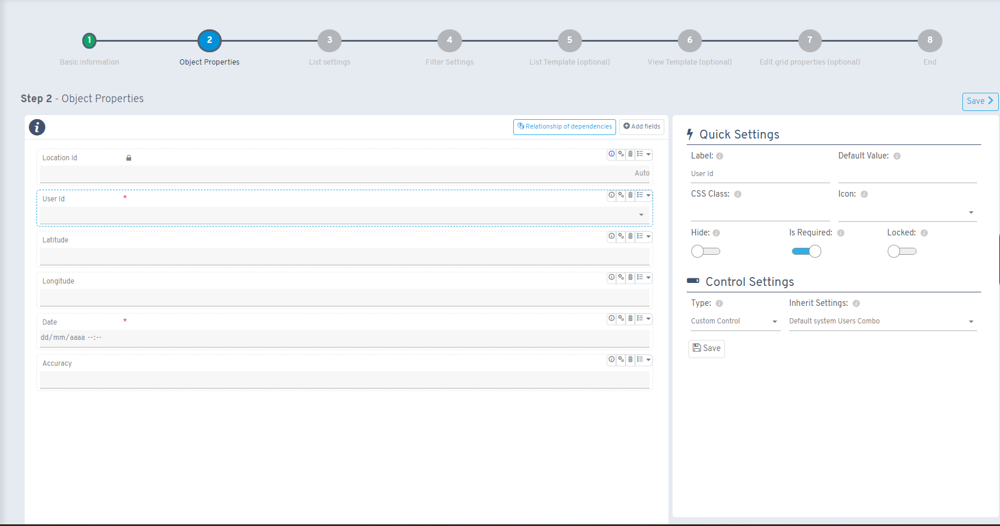
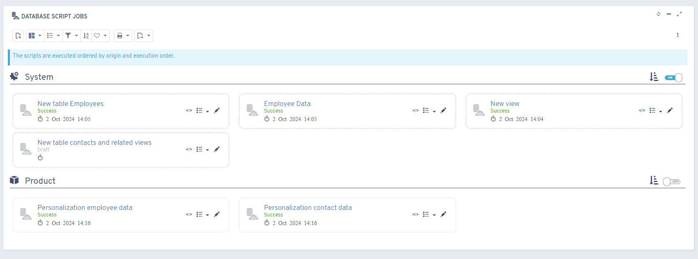

# Version 6.8

## New features

* New option to download document management/image files with database names

* New toolbar button to exclude it from the history
* Redesigned property manager with a quick options panel

* Changed script job execution order to take the source into account
* Improved script job display with an option to sort by source

* Ability to send emails with OAuth2 accounts through the `SendTemplateMail` function

## Fixes

* Fixed structure scripts
* Presets when processing values with defaults
* Refreshing listings while keeping filter values
* Selecting items in bulk processes while preserving preset text
* Tracking when submitting location
* Saving objects with an incremental primary key and an additional table
* DevExpress-type reports
* General search
