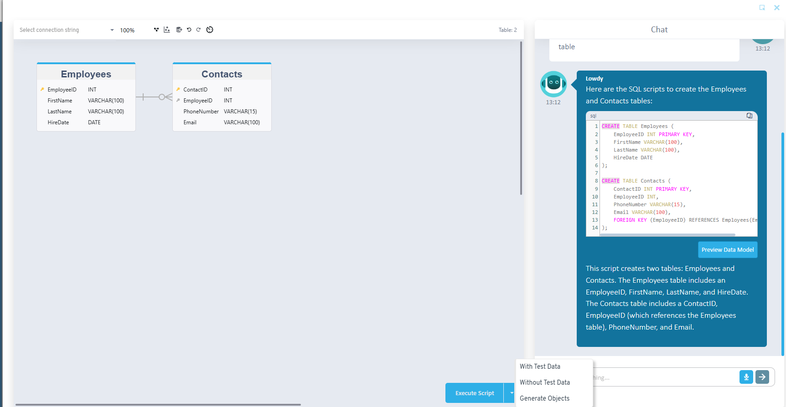
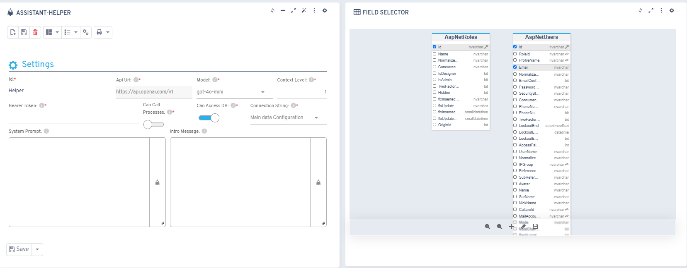

# Versión 6.9

## Novedades

* Nueva opción para crear modelo de datos a través de la integración con ChatGPT

* Nueva posibilidad en la integración con ChatGPT para habilitar la ejecución de procesos

* Nueva posibilidad en la integración con ChatGPT para habilitar el acceso a tablas y campos de la base de datos

* Nueva configuración en la integración con ChatGPT que permite la creación de objetos
* Nuevos eventos al subir/borrar imágenes desde el gestor de imágenes

## Correcciones

* Mejoras en el comportamiento del panel de opciones rápidas del administrador de propiedades
* Correcciones a la hora de devolver un campo fecha/hora a través de la WebAPI
* Arreglos en el gestor de imágenes al guardar un archivo png con fondo transparente
* Correcciones en componente flx-orgchart cuando el módulo está configurado con un "esqueleto"
* Arreglos en las dependencias entre propiedades en los filtros
* Correcciones al refrescar un módulo de tipo listado y que mantenga su scroll
* Correcciones al asignar una cuenta de correo desde el gestor de correos
