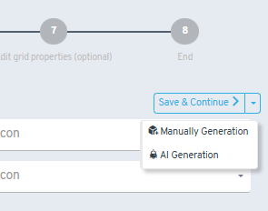
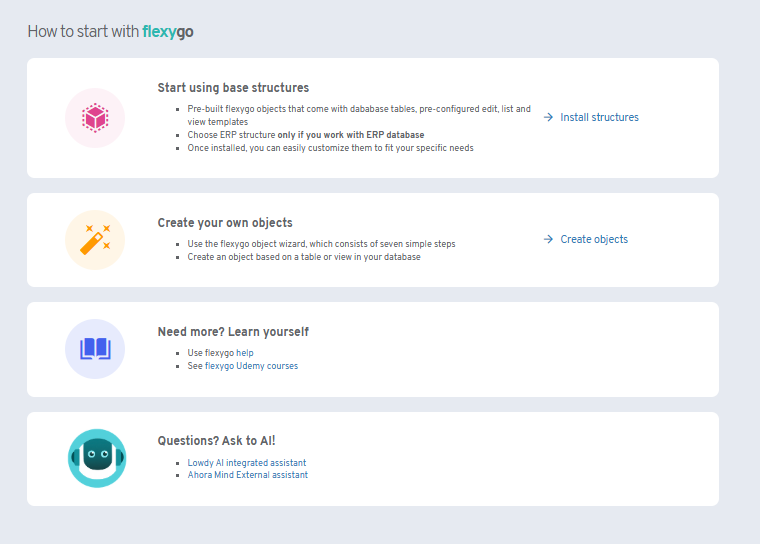
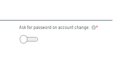

# Version 6.10

## New features

* Updated the offline app emulator to the latest version
* Integrated AI assistant for creating objects based on existing tables

* Latency logging for mobile synchronizations
* Insert/update/delete processes via stored procedures can now customize success messages
* Built-in AI help in Flexygo, supporting both internal and external assistants

* Optional password re-entry when switching accounts in the offline app

* WebAPI can now receive JSON objects directly
* Offline SQL properties added to the quick assistant
* Notice sentences now support the use of context variables

## Fixes

* Notification redirects now close the popover
* WebAPI schema handles inconsistencies between objects and collections correctly
* Various style improvements
