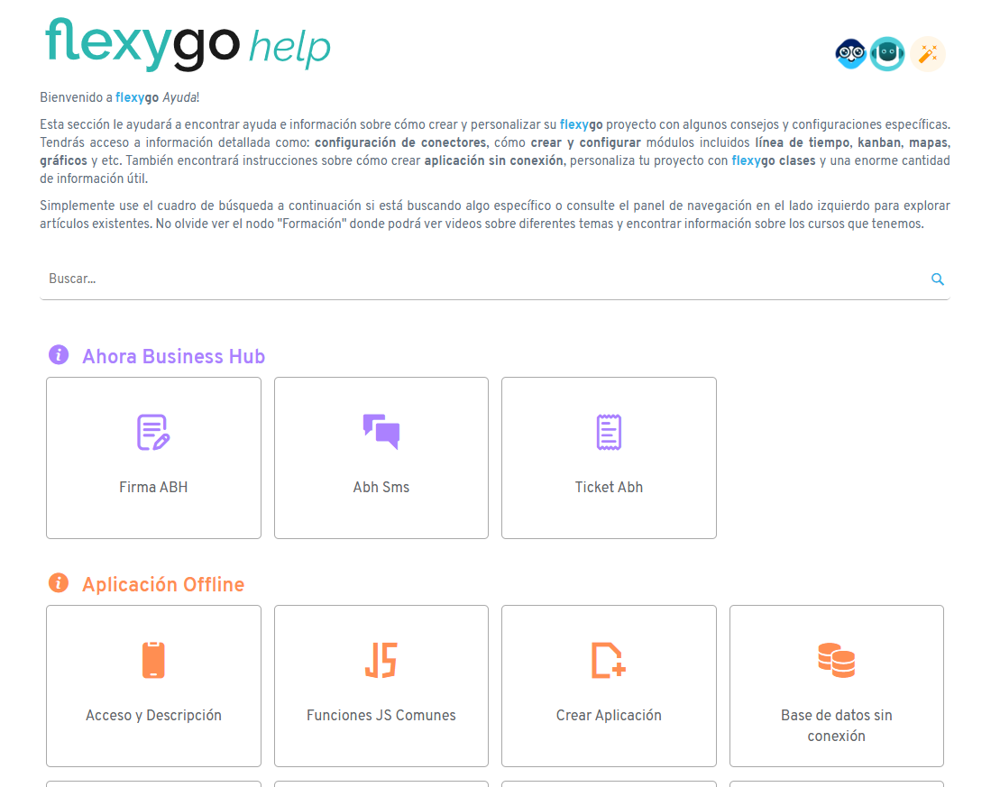
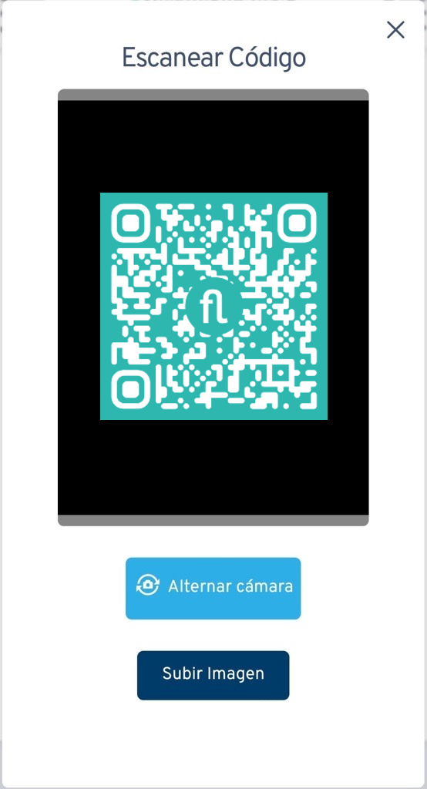
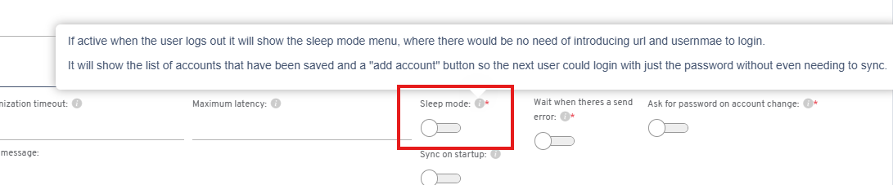

# Versión 7.0

## Novedades

* Traducción de la ayuda integrada de Flexygo a castellano

* El control de lectura de código de barras ahora puede leer códigos QR con interfaz rediseñada para ordenador y dispositivos móviles

* Actualizado el emulador del app offline a la última versión
* Los procesos de la WebApi pueden encadenar procesos pre-ejecución y post-ejecución
* El proceso de envío de datos en aplicaciones offline puede encadenar procesos pre-ejecución y post-ejecución
* El archivo `manifest.json` ahora es personalizable (búsqueda: `./custom/manifest.json`, `./product_manifest.json`, `./manifest.json`)
* Nueva configuración para habilitar modo en espera en aplicaciones offline

* Las propiedades en el administrador se añaden en segundo plano
* Se guarda el token del dispositivo al enviar datos en aplicaciones offline
* Nueva opción en planificador para elegir si tarjetas laterales vuelven disponibles tras arrastrar

## Arreglos

* Correcciones en módulo de planificador
* Exportación a Excel de listados con seguridad
* Dependencias en propiedades personalizadas
* Valores predeterminados decimales
* Dependencias de filtro SQL para propiedades radio y multi-check
* Paginación en módulos con cláusula WITH
* Dependencias en propiedades de imagen
* Desplazamiento de scroll al refrescar módulos
* Verificación de seguridad en botones de procesos relacionados con colecciones
* Exportación a Excel desde colecciones
* Generación de informes HTML
* Administrador de propiedades
* Adición de módulo tabulador desde asistente rápido
