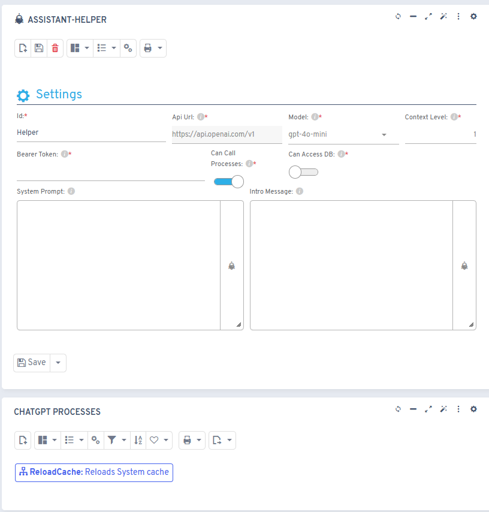
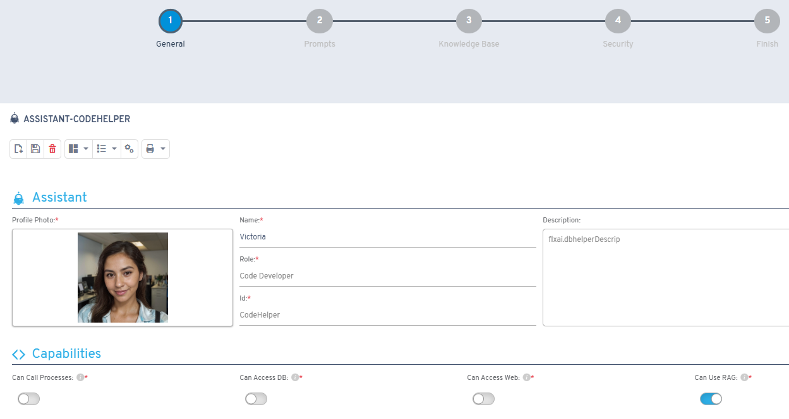
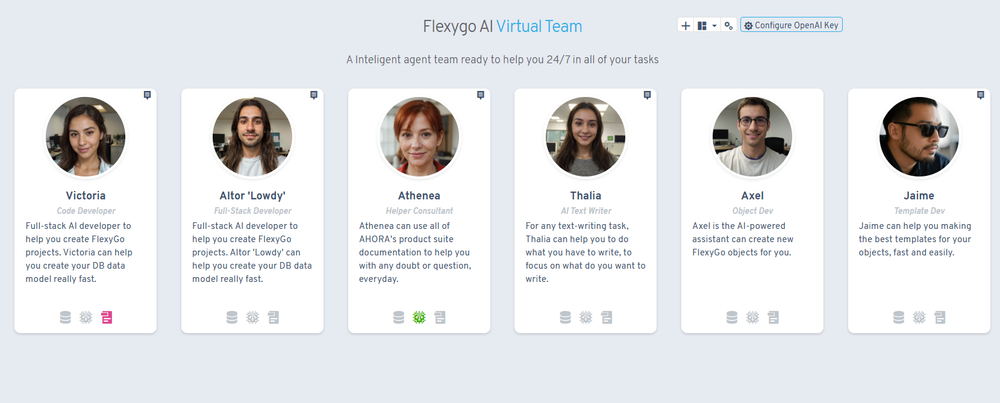
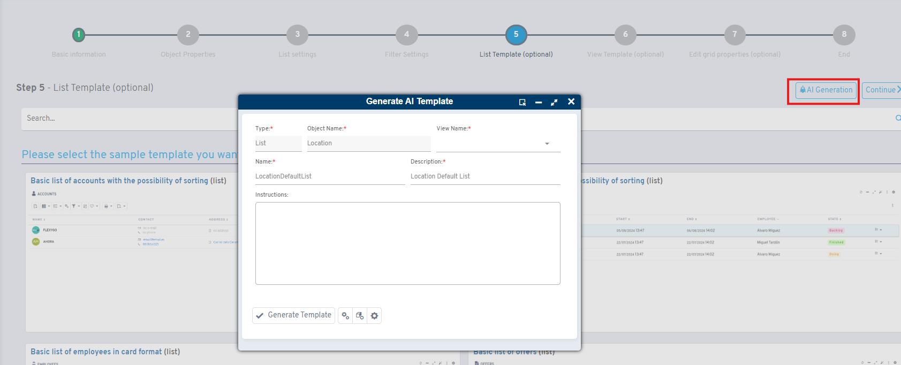
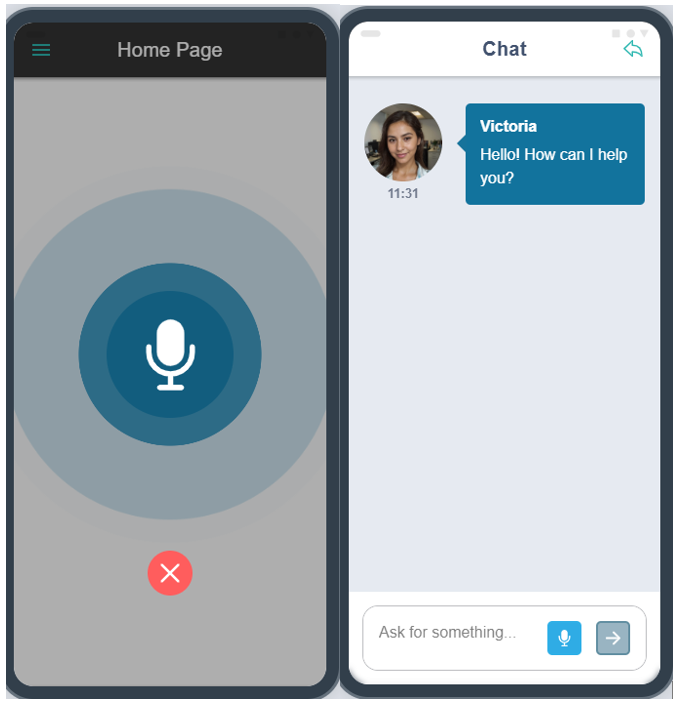
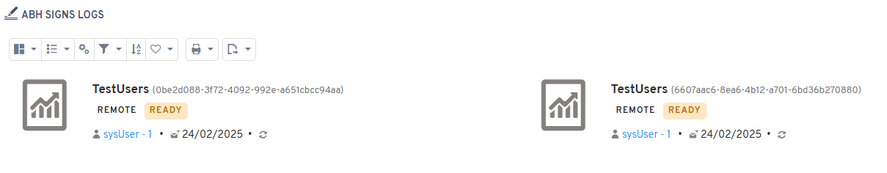
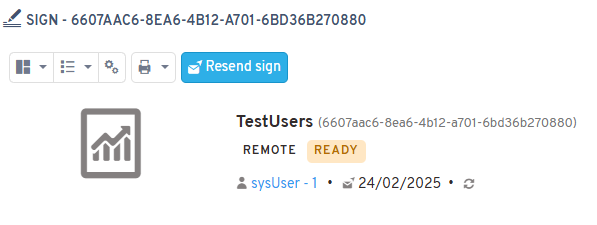

# Versión 8.0

## Novedades

### Mejoras en integración ChatGPT

* Activación de la funcionalidad RAG
* Capacidad de inserción de registros para objetos
* Activación de la función de búsqueda en internet
* Soporte para subida de imágenes

### Gestión de asistentes ChatGPT

* Nueva interfaz de asistente para insertar/actualizar asistentes ChatGPT

* Listado de asistentes ChatGPT rediseñado

* Nuevo sistema de logs para asistentes ChatGPT
* Asistente de generación de plantillas potenciado por ChatGPT

### Capacidades de la aplicación offline

* Los asistentes ChatGPT ahora pueden usarse en aplicaciones offline

* Actualización del emulador de app offline a la última versión

### Funciones de firma digital (ABH)

* Nuevo sistema de logs para envíos de firma mediante ABH

* Nuevo proceso de reenvío para firmas ABH

### Actualizaciones de interfaz/controles

* Rediseño del control flx-switch

## Arreglos

* Correcciones de estilo en el control flx-dbcombo
* Arreglos al clonar barras de herramientas
* Corrección en el manejo de comillas simples en valores de página por defecto
* Solución a la doble ejecución de envíos de datos en app offline
* Comportamiento de scroll de módulo en modo pantalla completa
* Mejoras en el módulo planificador
* Corrección en la visualización del proceso "Ejecutar ahora"
* Correcciones de múltiple refresco en el componente flx-easyinfo
