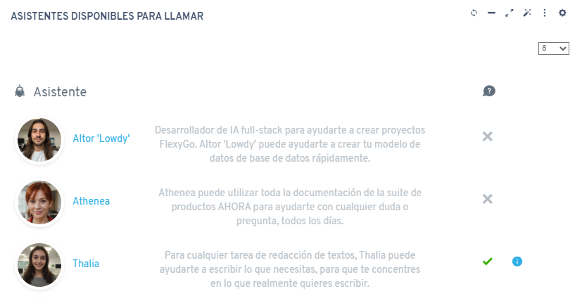
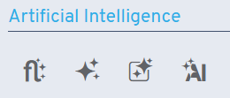

# Version 8.1

## New features

* Ability to sign in through Ahora Business Hub in the offline application

* Webhooks can return the full process assistant or just the data object
* New functionality in AI assistants that lets you use other AI assistants

* Updated the offline application emulator to the latest version
* Added new AI-related icons

* Added process chain executions to cron jobs
* Ability to select which connection strings are loaded in Monaco controls

## Fixes

* Reordering lists with long property values keeps text overflow working properly
* Adjustments to spacing in the dependency editor
* Fixes when loading complex database definitions in Monaco controls
* Fixes regarding mandatory parameters of processes run by AI assistants
* Fixes to AI assistants' voice chat
* Excluded unnecessary fields when using custom script jobs
* Fix for setting null values that were not originally null
* The property assistant now shows the decimals field when selecting the decimal type
* Fixes when getting the active interface on mobile devices
* Fixes to value dependencies with multiple radio controls
* Fix to getting context when opening AI assistants from the toolbar
* Fixed object relations with a default date type when saving
* Fixes to AI assistants' system prompt parsed with context variables
* Fixes to the "Get table changes" page when opened in a modal
* Fixes to AI assistants when configuring record insertion
* Fixes to master tables with date-type fields
