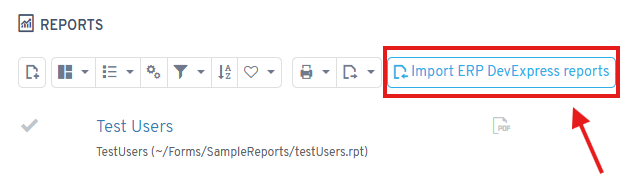
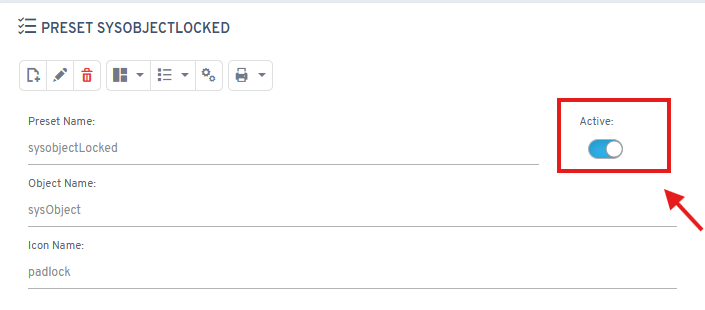
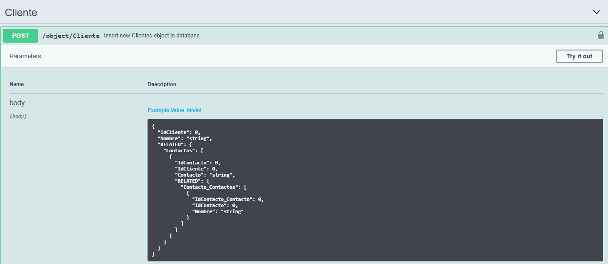

# Version 8.2

## New features

* **Multiple signature**: added the ability to sign a document with up to 5 people using ABH Sign
* **DevExpress integration**: new process to import reports from Ahora ERP (requires activation)

* **Stored procedures**: new type for inserting, updating and deleting objects with JSON
* **Improved offline app**: emulator updated to the latest version
* **Preset management**: ability to enable or disable presets linked to objects

* **Improved WebAPI**: ability to insert related objects and collections

* **Enterprise authentication**: modify the afterlogin process with the "User SQL Impersonate" type when Ahora ERP is integrated
* **Swagger documentation**: improvements including required fields, default values, configurable combos and descriptions

## Fixes

* Fixes to the quick property configuration
* Fixes when inserting a record through the WebAPI with a disconnected property
* Fixes to maintenance mode
* Performance improvements for AI assistants
* Fixes to the display of ChatGPT assistants on mobile devices
