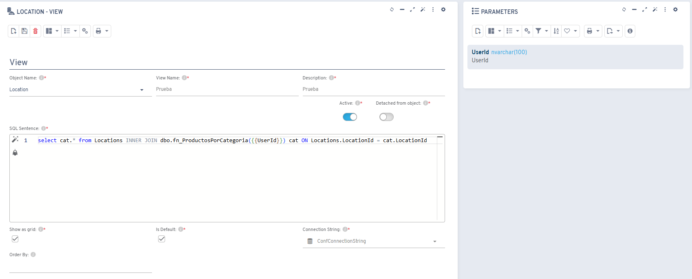
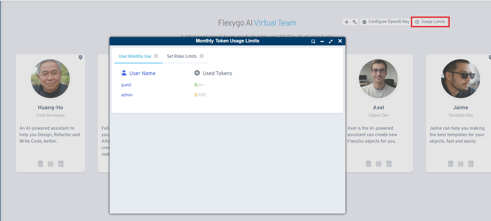

# Version 8.3

## New features

* Added the ability to add parameters to object views

* Updated the offline application emulator to the latest version
* Ability to limit AI assistant token usage by user role

* New functionality to filter a RAG's documents by object
* Ability to start an AI chat with an initial user message
* New OpenAI models available for assistants

## Fixes

* Fixes to filtering combo-type controls in HTML
* Fixes to additional tables in Oracle databases
* Offline sync: if permission to fetch the avatar is missing, it will keep showing the default image
* Fixes to connection strings of object views with ORDER BY
* Fixes when adding values from a combo in processes and reports
* Multiple performance improvements to AI assistants
* Fixes to sample structures
