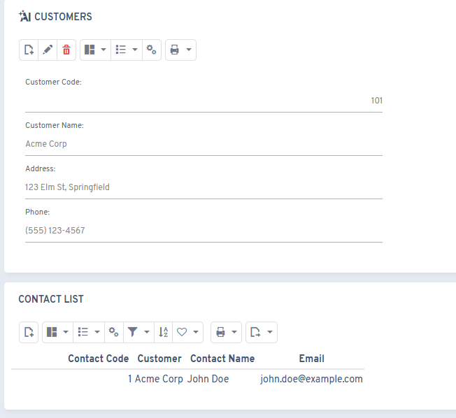
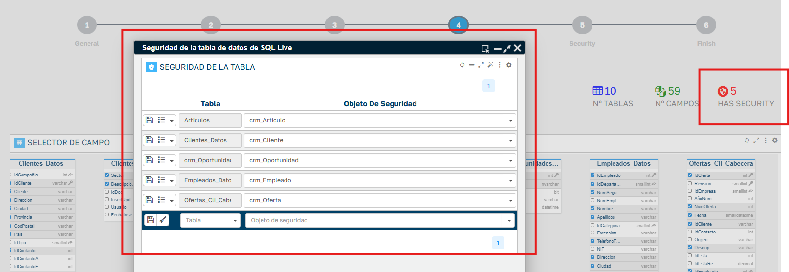

# Version 8.4

## New features

* When a data model with related objects is created via AI, it now automatically generates the relation and its associated module

* New `FLEXYGO.SysGPTTools.AnalyzeDocumentAsync` function to analyze documents, with the ability to add JSON schemas in AI assistant responses
* Updated the offline application emulator to its most recent version
* Added a loading screen to Excel reports
* Excel-type reports now accept parameters
* Option to implement security on tables queryable by AI assistants

* Introduced the GPT-5 AI models

## Fixes

* Fixed decimals in the Redsys integration
* Fixes to multicombo controls
* Fixed parameters in views
* Adjustments to RAG synchronization with impersonation
* Fixed dependencies in multicombo controls
* Fixed display of the flx-range component on iPad and iOS devices
