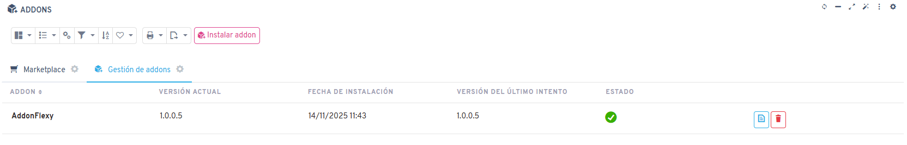
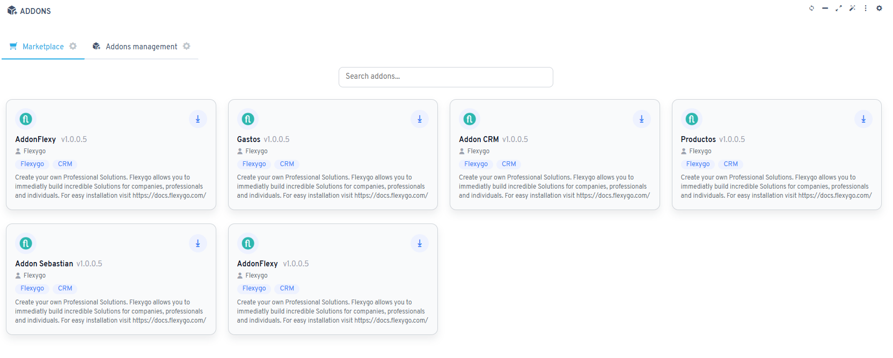

# Versión 8.5

## Novedades

* Mejoras en la creación de registros de objetos mediante asistentes de IA
* Actualización del emulador de la app offline a su última versión
* Nueva funcionalidad para la instalación y el desarrollo de addons

* Incorporación de un nuevo marketplace de addons

* Posibilidad de exportar datos a un archivo de Excel mediante asistentes de IA
* La descripción del informe ahora se parsea con los valores del objeto
* Reconocimiento de texto en las imágenes dentro de los PDFs en RAGs

## Arreglos

* Ajustes en los estilos de los botones del control Editor HTML dentro del edit grid
* Ajustes en el componente edit grid para permitir un ancho superior al 100% del módulo
* Corrección en la visualización de valores por defecto en el asistente de propiedades
* Solución a la ejecución de informes que recibían un parámetro de texto vacío
* Ajustes al insertar objetos mediante la Web API
* Correcciones en el manejo de errores en procesos ejecutados mediante cron jobs
* Solución a problemas en la gestión de archivos adjuntos dentro de los asistentes de IA
