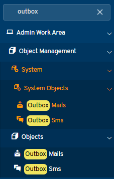
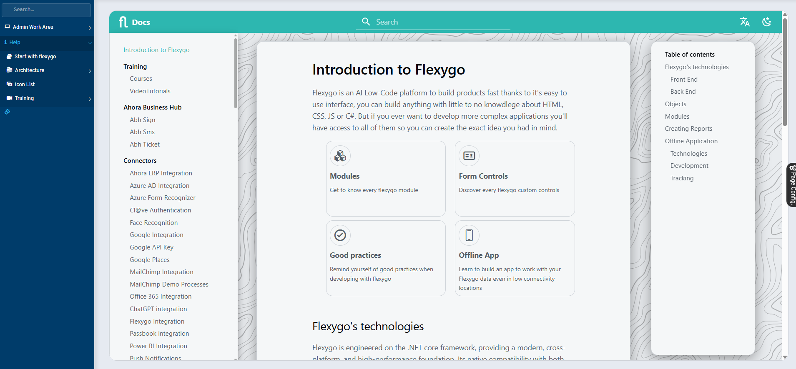

# Version 9.0

## New features

* **New search bar**: integrated into menu navigation to make it easier to access features

* **Improved offline authentication**: ability to sign in to the application without a connection through LDAP
* **Redesigned help system**: improved and restructured built-in help, now also available externally at <https://ayuda.ahora.es/Flexygo>

## Fixes

* Adjustments to processes with strings containing parameters to ensure they are sent correctly
* Fixes to filter dependencies with multiple tab-type modules
* Improvements to chart SQL queries to parse default values
* Fix to the addon uninstall process
* Updated welcome email template with a more customizable `{{Msg}}` token
* Multiple performance optimizations for AI assistants
