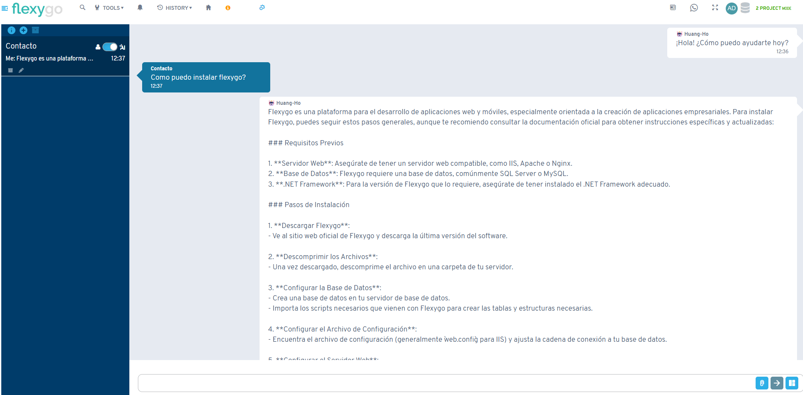

# Versión 9.1

## Novedades

* Nuevo addon **FlxWhatsapp** para integración con WhatsApp (requiere adquisición de módulo de licencia)

* Capacidad de devolver `HttpStatusCodeResult` en webhooks
* Los avisos ahora soportan valores predeterminados
* Limpieza automática de tokens de correo electrónico al modificar cuenta o endpoint

## Correcciones

* Ajustes en la barra de búsqueda dentro de la navegación de menús
* Corrección en la lógica de carga de estructura de base de datos en Monaco
* Mejoras en generación de plantillas con asistente IA para modelos de datos
* Arreglos en creación de objetos con IA que no agregaba propiedades y plantillas en ciertos dispositivos
