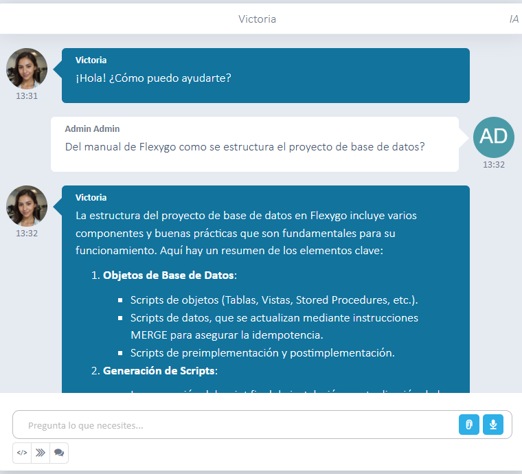

# ¿Sabías que puedes habilitar la funcionalidad RAG a un agente IA?

Para activar la funcionalidad RAG en tu agente, accede a la configuración y habilita la opción **Can Use RAG**. Luego, en el paso del asistente denominado **Knowledge Base**, puedes asociar una o varias configuraciones RAG que contengan los documentos que el agente interpretará.

Una vez configurado correctamente, podrás realizar consultas al agente sobre la información contenida en esos documentos.

