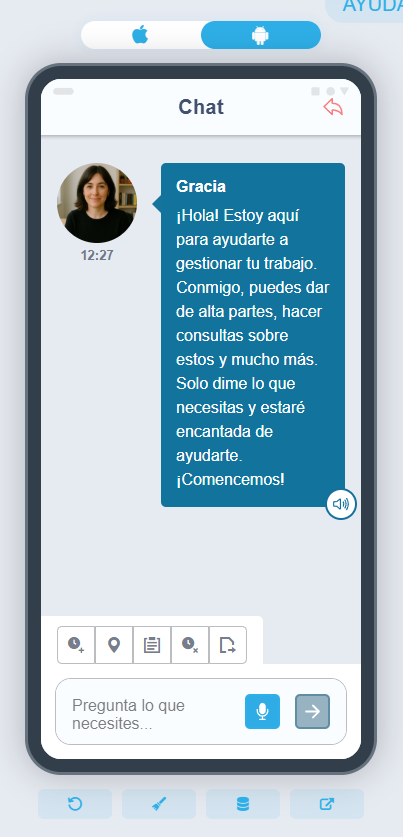

# Did you know you can use AI in the Flexygo app?

If your Flexygo instance has an AI assistant configured, you can access it directly from the mobile application, as long as you have an internet connection.

## Technical implementation

To enable this feature, use the JavaScript function `flexygo.nav.goAI`, passing the assistant's identifier as a parameter. This instruction will automatically navigate to a dedicated screen where you can interact with the AI assistant.

## Requirements

* An AI assistant configured in your Flexygo instance
* An active internet connection on the mobile device
