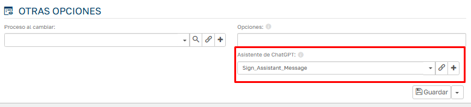
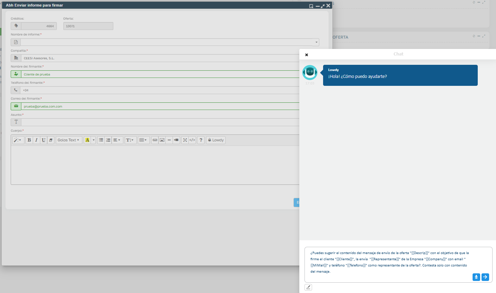

# Did you know Flexygo's AI can autocomplete any text?

Flexygo offers an AI-powered autocomplete capability. To use it, you need to select the desired agent in the property's configuration.

With this feature enabled, the AI can assist with various tasks such as:

* Writing news content
* Drafting emails
* Reviewing code
* Other custom functionality

The system uses the form's fields that trigger the autocomplete capability as its basis, generating contextualized text based on the data available in the form.

## Screenshots

