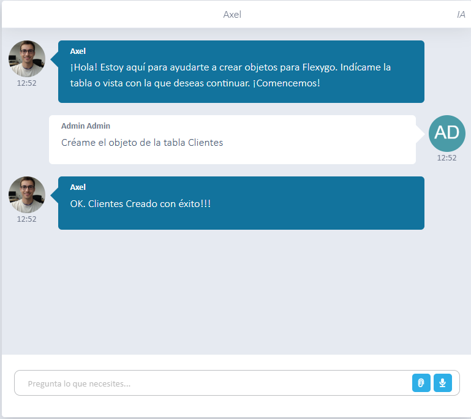
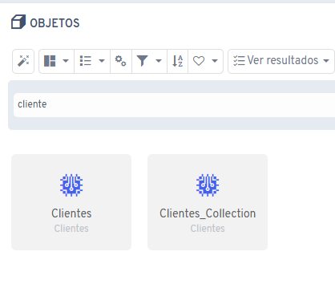

# Did you know Flexygo's AI can create objects for you?

Flexygo's AI assistant can create new objects based on a specific table. For example, you can ask the assistant: *"Create the object for the Customers table"*.

## Features

* Functionality based on natural-language commands
* Automatic generation of objects from existing tables
