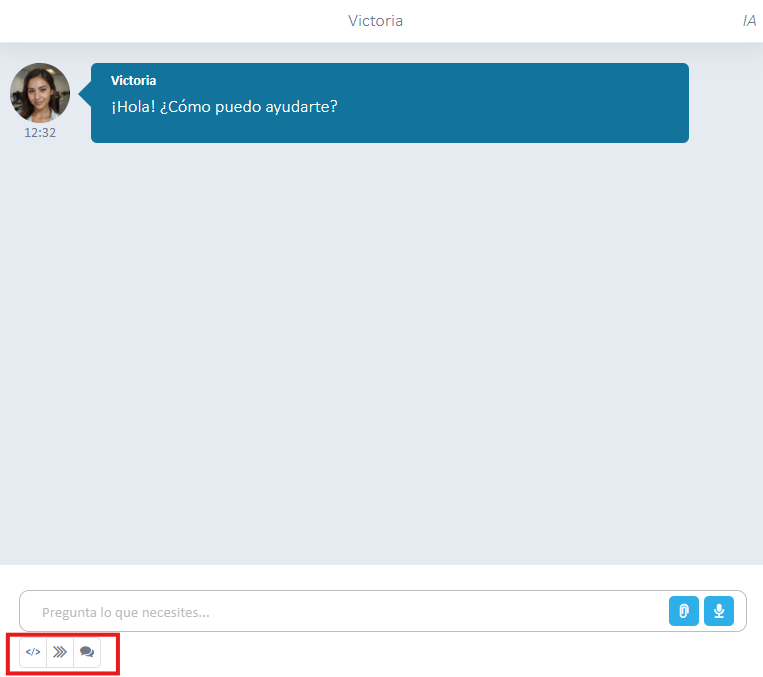

# ¿Sabías que puedes establecer prompts por defecto en un agente IA?

Desde la configuración de tu agente, en la sección denominada **Prompts**, tienes la capacidad de establecer indicaciones predeterminadas. Esta funcionalidad facilita que los usuarios proporcionen información de manera más sencilla al agente.

El objetivo es simplificar la interacción inicial, permitiendo definir de antemano qué tipo de datos o contexto debe solicitar o considerar el agente por defecto.

