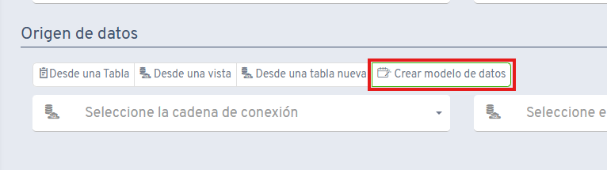
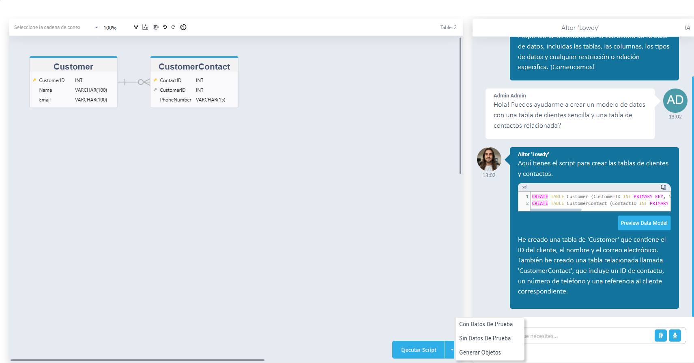

# ¿Sabías que con la IA de Flexygo puedes generar tu modelo de datos?

Desde el asistente de creación de un nuevo objeto, es posible seleccionar el botón **Crear modelo de datos**. Mediante esta opción, el asistente IA llamado Aitor "Lowdy" puede ayudarte a generar los scripts necesarios para tu modelo de datos según tus requisitos específicos.

## Funcionalidades

* Generación automática de estructuras de tablas (por ejemplo, una tabla de Clientes y sus Contactos relacionados)
* Creación de scripts con datos de prueba
* Opción de crear objetos de las tablas después de ejecutar los scripts

## Capturas

