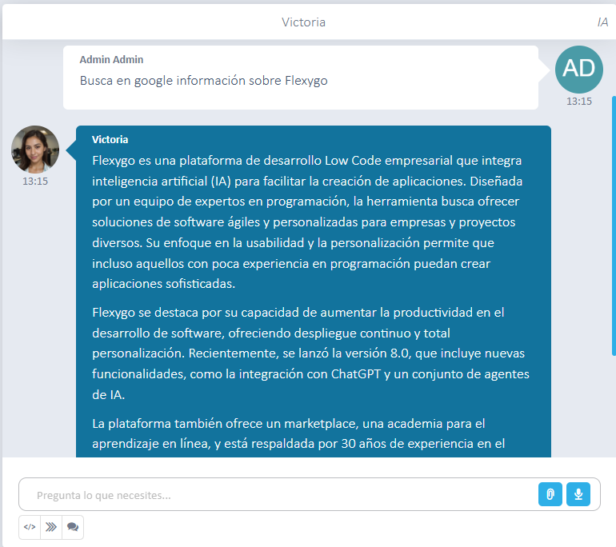

# ¿Sabías que con la IA de Flexygo puedes buscar información en Google?

Desde la configuración del agente, es posible activar la opción **Can access Web** para habilitar búsquedas automáticas en Google en tiempo real.

## Funcionalidad clave

Al activar esta configuración, los usuarios pueden solicitar al agente que realice consultas web. Un ejemplo: *"Busca en Google información sobre Flexygo"*.

