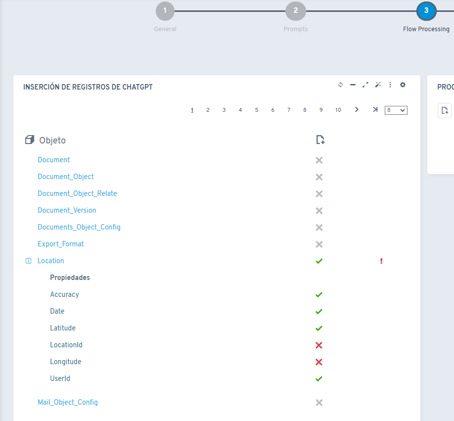
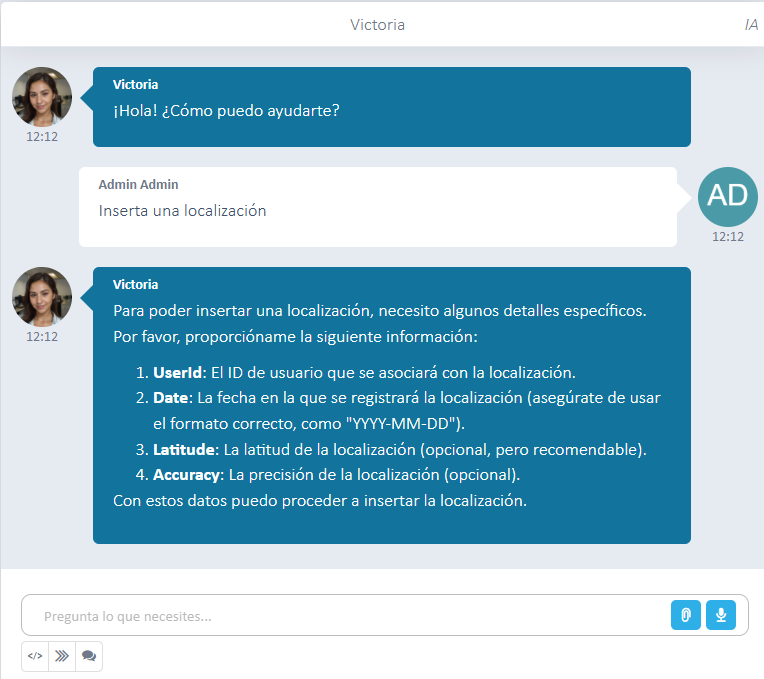

# Did you know Flexygo's AI can insert records for an object?

Flexygo lets you automate record creation through its AI functionality. To enable this feature, two configurations are required:

1. **In the agent's configuration**: enable the **Can call processes** option
2. **In the assistant's "Flow Processing" step**: select which object and properties your agent can insert

For example, with these settings enabled you can ask your assistant to register a location.

