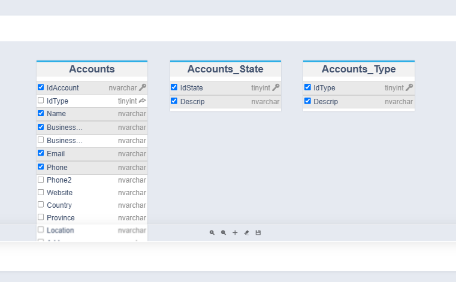

# ¿Sabías que con la IA de Flexygo puedes consultar datos sin saber SQL?

Puedes utilizar la funcionalidad de inteligencia artificial de Flexygo para acceder a datos sin necesidad de conocer SQL.

## Instrucciones de uso

Para implementar esta característica, los usuarios deben:

1. Acceder a la configuración del agente
2. Activar la opción **Can Access DB**
3. Definir a qué tablas y campos tendrá acceso el usuario

Una vez configurado, el agente será capaz de responder a preguntas consultando esas tablas en tiempo real de forma automática.

## Capturas

