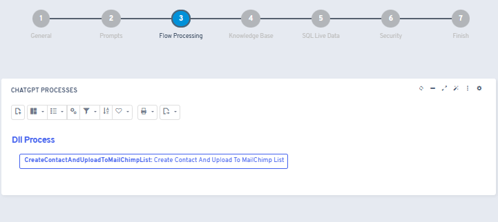

# ¿Sabías que con la IA de Flexygo puedes ejecutar procesos desde una conversación?

Flexygo permite automatizar la ejecución de procesos mediante conversaciones con IA.

## Instrucciones de configuración

Accede a los ajustes de tu agente y activa **Can Call Processes** para vincular aquellos procesos de Flexygo que desees ejecutar desde las conversaciones.

Esta característica permite interacciones como solicitar al agente *"Crea un cliente llamado Ahora con teléfono 666 666 666"*, y el sistema lo registrará automáticamente en el sistema.

## Capturas

