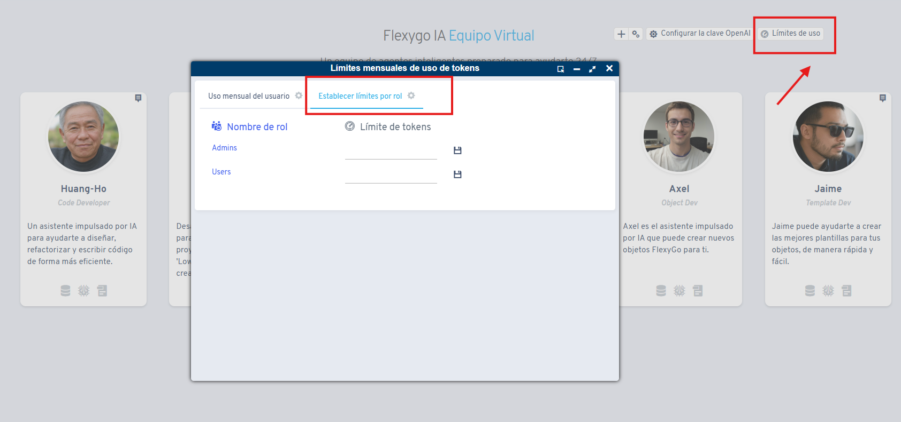

# ¿Sabías que puedes establecer límites de uso para los asistentes IA de Flexygo?

Desde el listado de agentes podemos limitar el uso del token a los usuarios para los asistentes IA por rol. Esta funcionalidad permite a los administradores gestionar y controlar el gasto de tokens de los usuarios según su rol dentro del sistema.

Flexygo ofrece la capacidad de establecer restricciones de consumo de tokens para los asistentes de inteligencia artificial. Estos límites se configuran a nivel de rol de usuario, lo que proporciona control granular sobre el uso de recursos y presupuesto.

## Propósito

La restricción de límites de uso de tokens ayuda a las organizaciones a:

* Controlar el gasto asociado con los asistentes IA
* Gestionar el consumo de recursos por usuario
* Implementar políticas de uso según el rol organizacional
