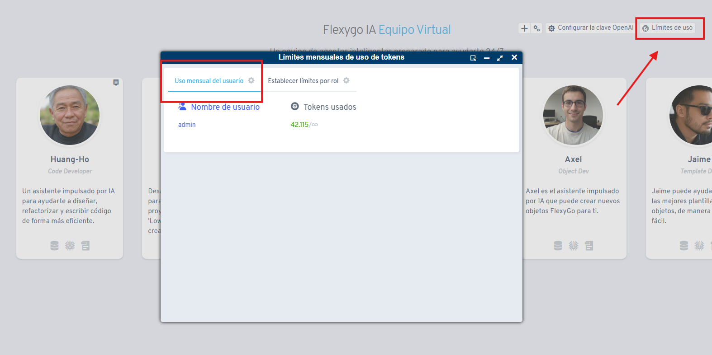

# Did you know you can see the monthly token usage for Flexygo's AI assistants?

From the agent list you can review the monthly token usage for AI assistants, broken down by user. This feature lets administrators monitor and control the resource spend associated with using AI assistants.

The Flexygo platform lets you view token consumption metrics on a monthly basis, making it easier to manage and oversee the use of AI tools at the individual user level.

