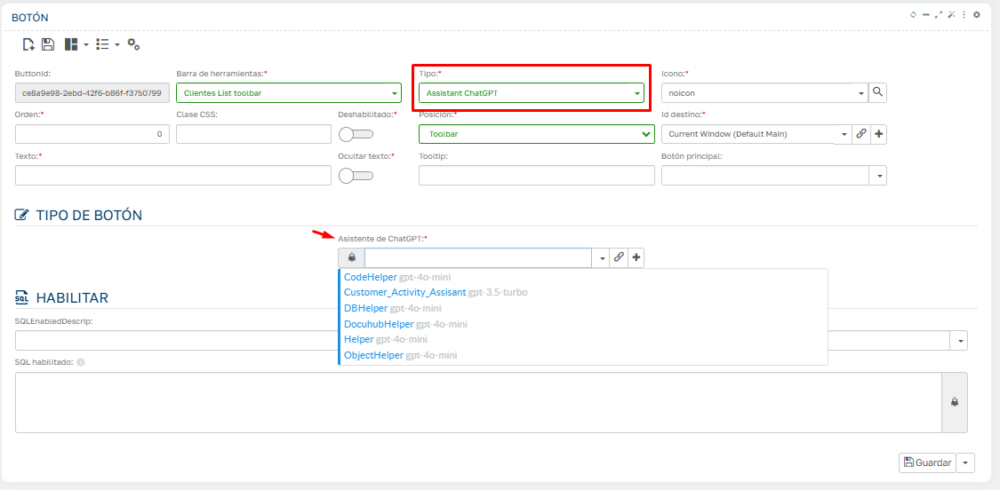

# Did you know you can attach an AI agent to a Flexygo toolbar?

To integrate an AI agent into a Flexygo toolbar, follow these steps:

1. Go to the toolbar where you want to add the agent
2. Create a new button of the corresponding type
3. Select the agent you want to launch
4. Confirm the configuration

Once this process is complete, you will be able to access, from that module, an agent capable of:

* Running processes
* Querying the database
* Searching the internet
* Accessing your document management (if configured to do so)

## Screenshots

