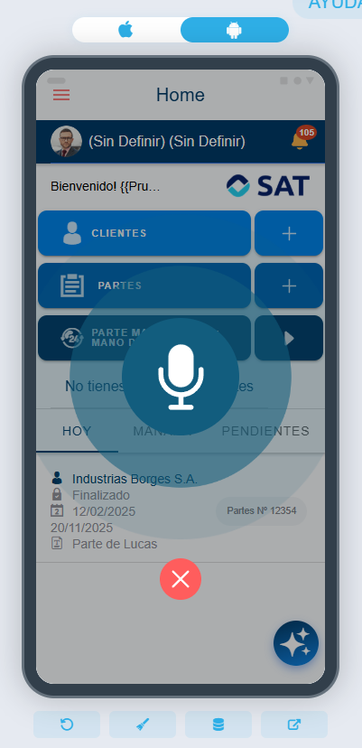

# ¿Sabías que a la IA de la app puedes hablarle directamente?

Además de la función `flexygo.nav.goAI` disponible en la aplicación de Flexygo, existe una función adicional llamada `flexygo.ai.startVoiceRecognition`.

Esta función requiere únicamente indicar el identificador del asistente. Al activarla, muestra un modal que comienza a escuchar lo que dice el usuario. Una vez finalizada la captura de audio, el mensaje se envía automáticamente al asistente de IA para que proporcione su respuesta.

