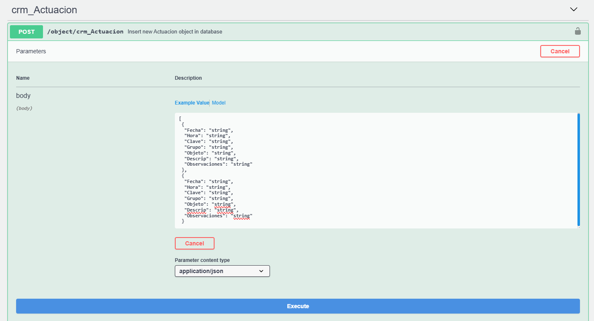

# Did you know Flexygo's API can accept collections?

Flexygo's API has a notable capability: it can process multiple records at once. When an array of objects is sent instead of a single object, the system tries to insert each item independently.

An important safety feature is that if a problem arises during the process, the API will have tried to insert each of them independently. If any problem occurs, it will roll back all the changes made, guaranteeing data integrity.

This transactional behavior protects the database against partial inserts, ensuring that either every operation completes successfully, or none of them are applied.

