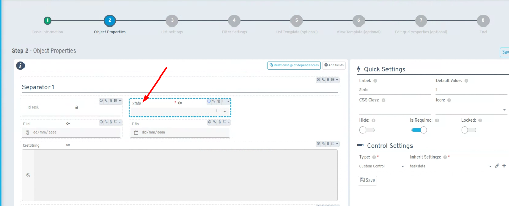
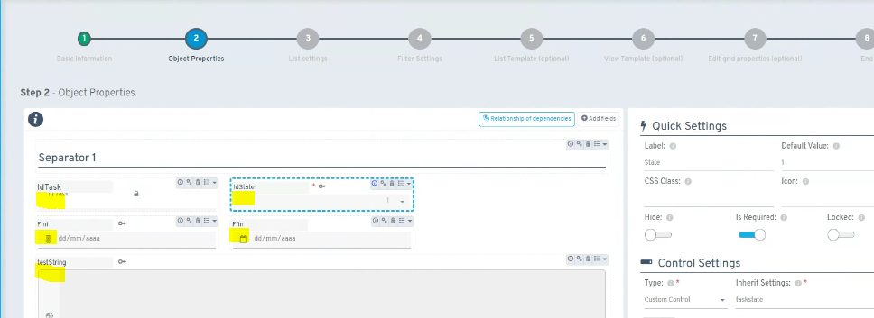

# Did you know pressing ALT lets you view property names?

You can quickly view the actual names of properties while configuring them for an object in the wizard.

## Instructions

To view property names, hover the cursor over any property's label and hold down the **ALT** key. This action will automatically reveal the properties' actual identifiers instead of their descriptions or visible labels.

