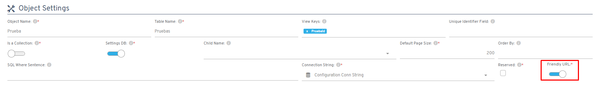

# Did you know you can link Flexygo to a BI tool or any other system very easily?

Linking Flexygo with Business Intelligence tools or external systems is a straightforward process.

## Main steps

1. **Enable Friendly URLs** on the objects you want to link, using the corresponding checkbox
2. **Generate links** with the format:
    ```
    https://crm.myflexygo.com/view/crm_cliente/25
    ```
3. **Simple integration**: generate these links from any software and open them in the browser

## Additional information

For more information, with every access possibility, check the built-in help at **Help → Information → Friendly Urls**.


