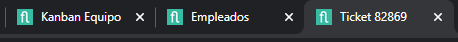

# Did you know there's a parameter to set the browser window's title pattern?

Starting with version 4.9.0.x, Flexygo offers a new setting called **WindowsNameStructure** that lets you customize the browser window's title using specific patterns.

## Available placeholders

The setting accepts the following variables:

* **{{ObjectDescrip}}**: shows the object's description, if it exists
* **{{PageDescrip}}**: shows the object's description or, failing that, the page's description
* **{{ProyectName}}**: shows the project's name

## Benefit

This feature lets you change browser window titles to provide more relevant and contextual information about their content, improving the user experience and navigation within the Flexygo platform.

