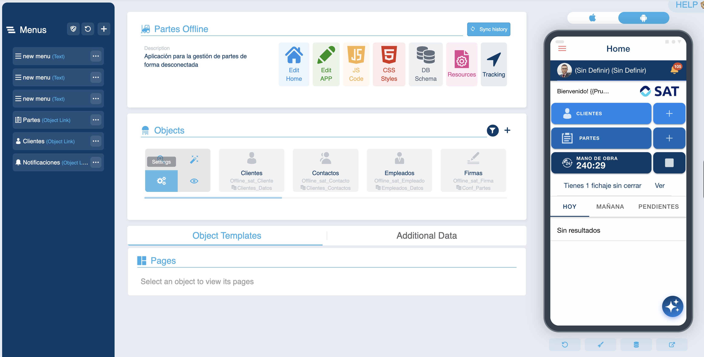
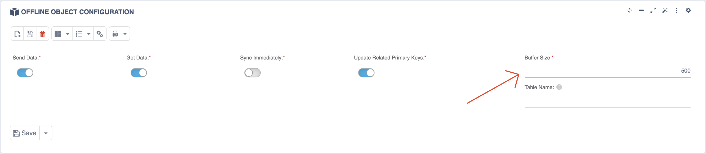

# ¿Sabías que puedes modificar de cuántos en cuántos registros se trae la app un objeto?

Desde la configuración de un objeto es posible ajustar la cantidad de registros recuperados durante la sincronización. Este parámetro, denominado **tamaño del buffer**, impacta directamente en el rendimiento del proceso.

## Modificación del tamaño de buffer

Para realizar el ajuste, solo necesitas modificar la propiedad denominada **tamaño de buffer**. Los beneficios varían según la configuración:

* **Buffers más grandes**: permiten una sincronización más rápida al procesar múltiples registros por iteración
* **Buffers más pequeños**: recomendados para tablas con registros grandes o complejos

## Recomendaciones

La mejor práctica sugiere utilizar un tamaño de buffer reducido cuando trabajes con tablas que contienen registros pesados o complejos, evitando así errores o problemas de rendimiento. En contraste, para tablas más ligeras, se puede implementar un tamaño mayor para optimizar la velocidad de sincronización sin riesgo de sobrecarga.

