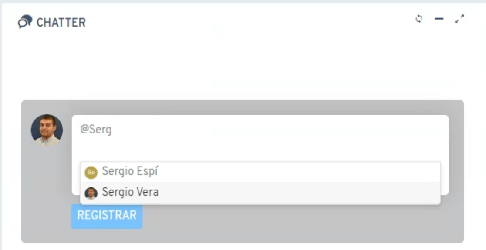
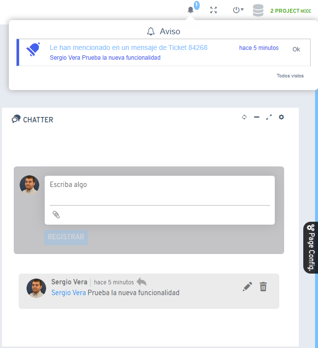

# Did you know you can mention other users in the chatter?

Since Flexygo version 4.11.0.x, users can mention other application participants in the chatter using the **@** symbol.

## Main feature

This lets you insert references to other users by typing "@" followed by the user's name in the chatter. When someone is mentioned this way, the system automatically sends a notification alert to the referenced user.

