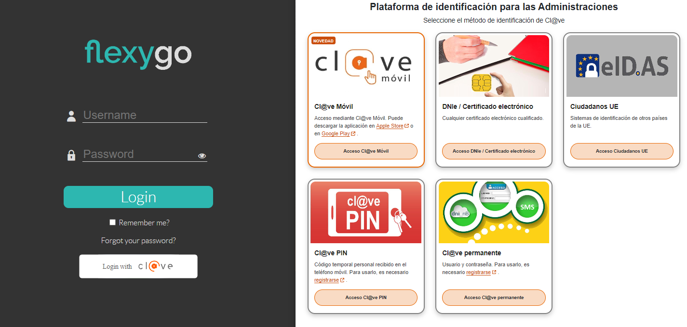

# ¿Sabías que en Flexygo puedes establecer el sistema Cl@ve como método de autenticación?

A partir de la versión 6.5 de Flexygo, los administradores pueden implementar el sistema Cl@ve como método de autenticación. Esta funcionalidad busca dos objetivos principales:

* Agilizar el acceso de los usuarios
* Reforzar las medidas de seguridad

## Instrucciones de implementación

Para conocer los detalles técnicos de cómo implementar esta característica, consulta la documentación dentro de Flexygo siguiendo esta ruta:

**Help → Connectors → Cl@ve Authentication**

## Capturas

