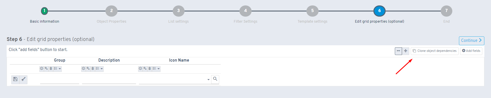

# ¿Sabías que puedes clonar las dependencias de un objeto a las de la colección?

Desde la versión 4.12.0.X de Flexygo, se ha implementado una funcionalidad que permite clonar las dependencias de un objeto hacia la colección.

## Acceso a la función

La característica se accede a través de un botón añadido en la configuración del edit grid. Al activarlo, aparece una opción para decidir el comportamiento del clonado.

## Opciones disponibles

* Sobrescribir las dependencias existentes en el edit grid
* Mantener las dependencias existentes sin modificarlas, agregando únicamente aquellas que no existan previamente

Esta funcionalidad optimiza el flujo de trabajo al permitir reutilizar configuraciones de dependencias de manera flexible, proporcionando control total sobre si se reemplazan configuraciones previas o se mantienen intactas.

