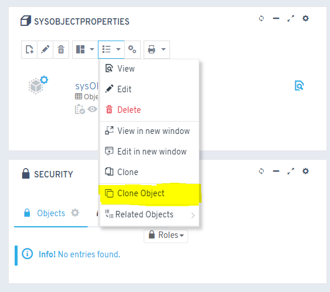

# Did you know you can clone an object based on another object?

Starting with version 4.9.0.x, you can duplicate objects along with their main configurations: properties, dependencies, relations, presets, views and templates.

## Procedure

1. Go to the object you want to duplicate
2. Run the object cloning process
3. Specify the new object's name
4. Select which options you want to include in the copy

