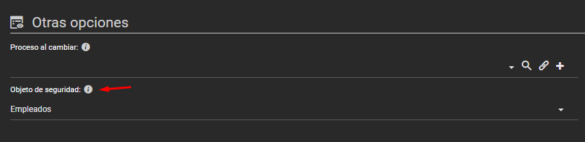

# Did you know you can apply an object's security to a combo?

When configuring a combo or dbcombo, there is an option called **"Security object"**. Selecting it applies the security configured on the object itself, avoiding the need to add where clauses in the query.

This feature simplifies configuring access controls by using the security rules already established on the object, without needing to add extra conditions directly in the SQL query.
