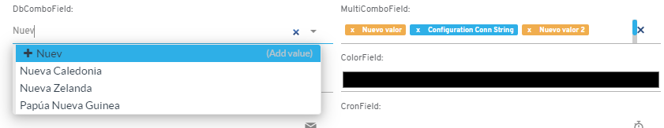
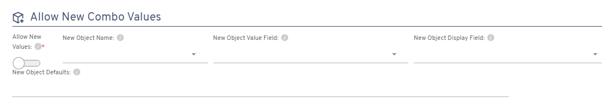

# Did you know you can configure combos to allow new values?

The `flx-dbcombo` and `flx-multicombo` components can be configured to allow new values to be added directly through them. When the record is saved, these new values are automatically added to the designated object.

## Configuration instructions

To enable this feature:

1. Go to the **Allow new values** option
2. Set up the required fields in the corresponding section

