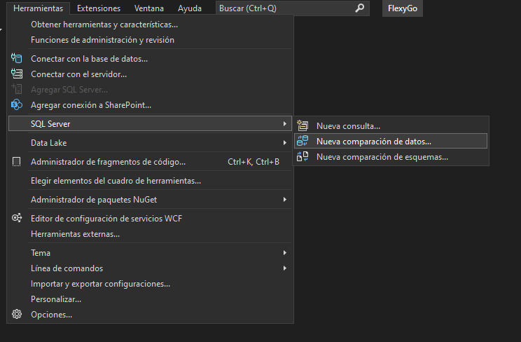

# Did you know you can compare two databases, both in structure and data, using Visual Studio?

Flexygo relies on tools built into Visual Studio that let you perform powerful database comparisons.

## Schema comparison

Going to **Tools → SQL Server → New Schema Comparison**, you can compare and update two databases, or a database and a Visual Studio project.

## Data comparison

Through **Tools → SQL Server → New Data Comparison**, users can compare two databases and generate scripts or perform direct updates.

