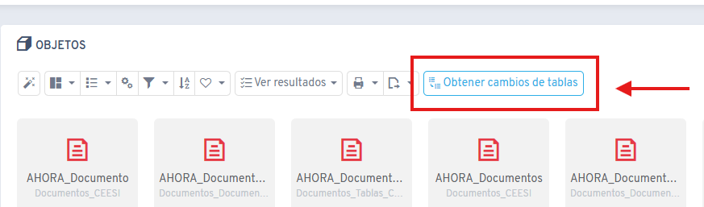
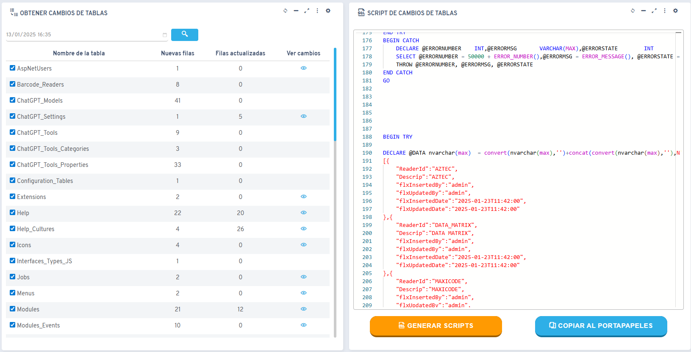

# Did you know you can get configuration table changes directly from Flexygo?

Flexygo lets you access the changes made to configuration tables directly from the application.

## Procedure

1. **Access**: the option to get configuration table changes can be found in the object list
2. **Setup**:
    * Specify the date from which you want to view changes
    * Select the specific tables to review
    * Generate a script with all the changes made

## Benefits

The generated script lets you easily view, review and copy the changes to use them later.

